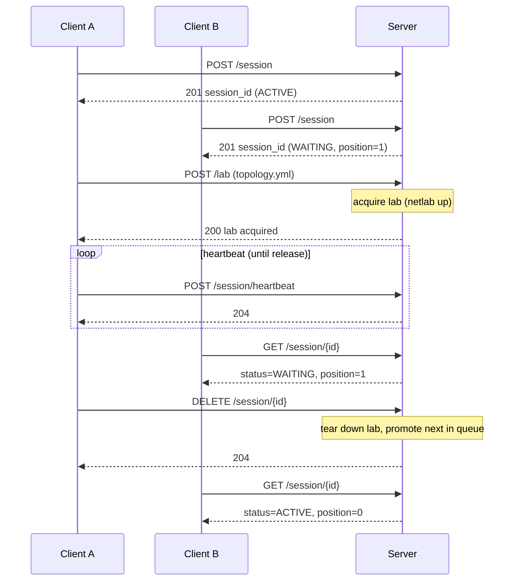

# Neops Remote Lab

> [!IMPORTANT]
> **Developer Preview Disclaimer**
>
> This repository is an early-stage developer preview and is not production-ready.
> While we are currently finalizing an open-source friendly license, all rights are
> reserved in the interim. We encourage you to explore the code, experiment with it,
> and share your feedback via issues or discussions. Use of this software is at your
> own risk and provided "as-is" without warranty.

[](https://pypi.org/project/neops-remote-lab/)
[](https://pypi.org/project/neops-remote-lab/)
[](https://github.com/zebbra/remote-lab/actions/workflows/ci.yml)
[](https://docs.neops.io/neops-remote-lab/docs/)
[](#)

*A FastAPI service exposing exclusive, queue-brokered access to a real [Netlab](https://netlab.tools/) topology — FIFO scheduling, content-hash-keyed lab reuse, reference-counted teardown, multi-vendor support (FRR, Nokia SR Linux, Cisco IOL).*

*Drive it from a pytest11 plugin (Python), the bundled REST API (any stack), or both.*

[On PyPI](https://pypi.org/project/neops-remote-lab/) · [Docs](https://docs.neops.io/neops-remote-lab/docs/) · [Worker SDK consumes it as a stable contract](https://docs.neops.io/neops-worker-sdk-py/docs/testing/30-remote-lab/)

## Install

For the **Python client / pytest fixture** (library install):

=== "uv (recommended)"

    ```bash
    uv add neops-remote-lab
    ```

=== "Poetry"

    ```bash
    poetry add neops-remote-lab
    ```

=== "pip"

    ```bash
    pip install neops-remote-lab
    ```

For the **runnable server CLI** (isolated install):

=== "uv (recommended)"

    ```bash
    uv tool install neops-remote-lab
    ```

=== "pipx"

    ```bash
    pipx install neops-remote-lab
    ```

> Picking between the two? Library install is what most consumers want — it gives you the pytest fixture and `RemoteLabClient`. CLI install is for operators standing up the server itself.

## Quick start

### Use it (consumer)

```bash
export REMOTE_LAB_URL=http://lab.example.com:8000
```

```python title="tests/conftest.py"
from neops_remote_lab.testing.fixture import remote_lab_fixture

demo = remote_lab_fixture("tests/topologies/demo.yml")
```

```python title="tests/test_demo.py"
def test_lab_has_two_devices(demo):
    assert len(demo) == 2
```

```bash
pytest -v
```

The fixture handles session creation, queue waiting, topology upload, heartbeat,
and teardown. The Worker SDK imports `remote_lab_fixture` directly as a
[stable public API](https://docs.neops.io/neops-worker-sdk-py/docs/testing/30-remote-lab/).

### Run it (operator)

```bash
neops-remote-lab            # binds 0.0.0.0:8000 by default
```

```bash
curl -s -o /dev/null -w "%{http_code}\n" http://localhost:8000/healthz
# 204 = alive
```

`netlab` must be on `PATH` — the launcher refuses to start otherwise. For a fresh
host, see [Netlab host setup](https://docs.neops.io/neops-remote-lab/docs/40-deployment/10-netlab-host-setup/);
for a `systemd`-managed deployment, see the
[Operator runbook](https://docs.neops.io/neops-remote-lab/docs/30-server/10-administration/).

## How a session flows



The full state machine, heartbeat cadence, and timeout semantics live on
[Session queue](https://docs.neops.io/neops-remote-lab/docs/10-concepts/20-session-queue/);
SHA-256-keyed reuse semantics on
[Lab lifecycle](https://docs.neops.io/neops-remote-lab/docs/10-concepts/30-lab-lifecycle/).

## Why use it

- **One lab per host, enforced.** Cross-process `filelock` + reference counting; two
  clients can't trample each other's topology. Topology identity is the SHA-256 of
  file content, so byte-identical files share a running lab.
- **Stable Python contract.** `remote_lab_fixture` is the public surface the
  [Worker SDK](https://docs.neops.io/neops-worker-sdk-py/docs/) imports directly.
- **Driveable from any HTTP stack.** pytest is convenient; cURL works; Go works;
  whatever you already have works.
- **Operator-friendly.** Single-instance `systemd` unit, structured logs, `/healthz`
  and `/debug/health`, automatic recovery from stale Netlab instances on startup.

## Environment variables

| Variable | Purpose | Default |
|---|---|---|
| `REMOTE_LAB_URL` | Base URL for client + fixtures | — (required) |
| `REMOTE_LAB_REQUEST_TIMEOUT` | Per-HTTP-request timeout (seconds) | `30` |
| `REMOTE_LAB_SESSION_TIMEOUT` | Client-side session-queue wait limit (seconds) | `600` |
| `REMOTE_LAB_ACQUISITION_TIMEOUT` | Max wait for lab acquisition (seconds) | `600` |

Timeout-coordination guidance + `RemoteLabClient` constructor overrides:
[Client config](https://docs.neops.io/neops-remote-lab/docs/20-client/30-configuration/).

## Network access

The service ships **without HTTP authentication** — the only access boundary on
`/lab/*` is the `X-Session-ID` of an active session. Treat it as internal-trust;
deploy behind a network enclosure. The recommended path is self-hosted
[Headscale](https://headscale.net/) + [Headplane](https://github.com/tale/headplane)
because that's what the project's reference deployment uses, but any equivalent
enclosure works (managed Tailscale, plain WireGuard, an internal VLAN with IP
allowlists, mTLS at a reverse proxy). Walkthroughs and alternatives:
[Headscale: quick setup](https://docs.neops.io/neops-remote-lab/docs/40-deployment/20-headscale-quick-setup/)
and its
[Other approaches](https://docs.neops.io/neops-remote-lab/docs/40-deployment/20-headscale-quick-setup/#other-approaches)
section.

## Troubleshooting

| Symptom | Likely cause + fix |
|---|---|
| Server exits with `Another Remote Lab Manager instance is already running.` | Stale single-instance filelock from a crashed prior run. See [Stale-lock recovery](https://docs.neops.io/neops-remote-lab/docs/30-server/10-administration/#stale-lock-recovery). |
| `Address already in use` on port 8000 | Prior server didn't exit cleanly, or another service holds the port. `lsof -i :8000` and kill, or start with `--port`. |
| `POST /lab` returns `423 Locked` | Caller's session isn't ACTIVE, or a different topology owns the host. `GET /session/{id}` to check; release / force-destroy if stuck. |

Full table:
[Debugging](https://docs.neops.io/neops-remote-lab/docs/30-server/50-debugging/).

## Documentation

The full docs are at **[docs.neops.io/neops-remote-lab](https://docs.neops.io/neops-remote-lab/docs/)**.
Common entry points:

- [**Use from Python**](https://docs.neops.io/neops-remote-lab/docs/20-client/) — pytest fixtures, `RemoteLabClient`, client config.
- [**Run the service**](https://docs.neops.io/neops-remote-lab/docs/30-server/) — install, `systemd`, security model, REST contract, debugging.
- [**Deploy & Operate**](https://docs.neops.io/neops-remote-lab/docs/40-deployment/) — Netlab host setup, VPN paths, vendor walkthroughs (FRR / SR Linux / IOL).
- [**Concepts**](https://docs.neops.io/neops-remote-lab/docs/10-concepts/) — architecture, session queue, lab lifecycle, topology format.
- [**Cookbook**](https://docs.neops.io/neops-remote-lab/docs/99-appendix/cookbook/) — runnable end-to-end recipes.

Interactive OpenAPI UI is at `http://<host>:8000/docs` once the server is running.

## Tests

```bash
make test                     # 39 tests; uses a stubbed LabManager (no Netlab needed)
```

## Contributing

Branch from `develop`. `make check` runs lint, typecheck, audit, and tests. Full
contributor guide: [Contributing](https://docs.neops.io/neops-remote-lab/docs/50-contributing/).

## License

See the **Developer Preview Disclaimer** at the top of this file. A formal
open-source license will be applied once finalized.
