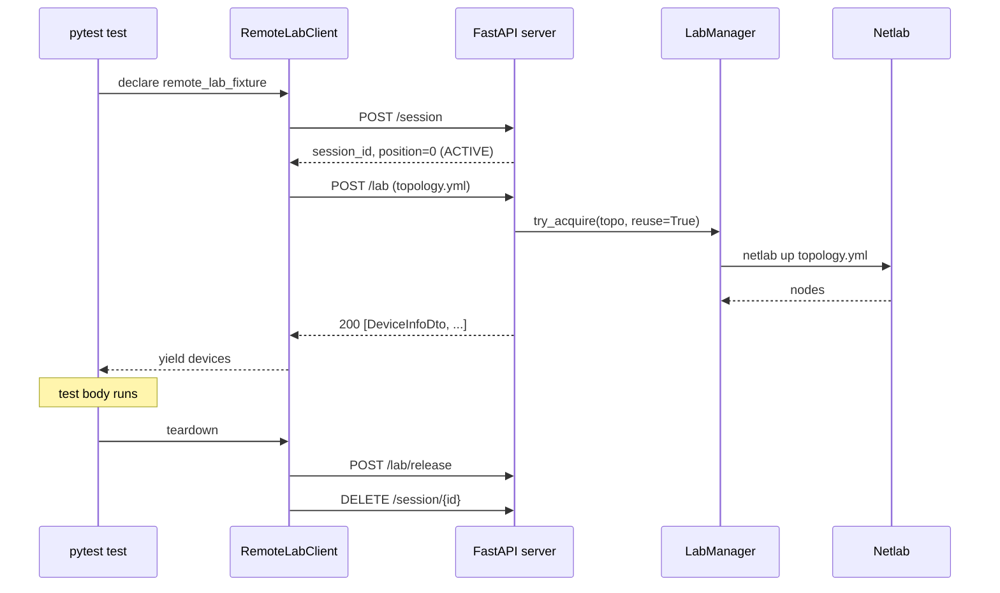

# Three-minute tour

*The shape of a Remote Lab interaction in four steps. No state-machine internals, no refcount math — that's the next four pages. Read this once to get the whole picture; then dig in.*

## What it does

Network-automation tests want a real router. [Netlab](https://netlab.tools/) only lets one topology run per host, so a shared lab host turns into a collision playground the moment more than one test wants to run. **Remote Lab puts a small HTTP service in front of that host** so several tests can share it safely — one at a time, but cleanly.

## The four steps

Every interaction follows the same four-step lifecycle:

1. **Create a session.** A test calls `POST /session`. The server appends the session to a FIFO queue and returns its UUID. If the queue was empty, the session is immediately *active* — at the head, ready to drive the lab.
2. **Wait to become active.** If someone else is at the head, the test polls `GET /session/{id}` until status flips to `active`. Polling itself counts as activity, so the queue won't time the session out while it waits.
3. **Acquire the lab.** The test uploads a topology via `POST /lab` (multipart). The server hashes the file content (SHA-256, **not** the filename), runs `netlab up`, and returns the device list. When two tests upload the same content, the second attaches to the running lab via reference counting — no second `netlab up`.
4. **Release.** When the test ends — pass or fail — the fixture calls `POST /lab/release`. The reference count drops; if no one else is holding the lab, the lab idles. The next acquire decides its fate (reuse, restart, switch, eventual cleanup on session timeout).

## How the components cooperate

*The pytest fixture, the Python client, the server, the LabManager, and Netlab — five participants, six round-trips, one passing test.*

The pytest fixture (`remote_lab_fixture`) is the public surface. It wraps `RemoteLabClient`, which wraps the REST API. You write three lines of test code; the rest disappears into the fixture.

## Where to go from here

-   :material-vector-arrange-above:{ .lg .middle } &nbsp; **[Architecture](10-architecture.md)**

    ---

    The three components in detail — FastAPI server, LabManager singleton, Python client + pytest plugin. The one-server and one-lab guards.

-   :material-format-list-numbered:{ .lg .middle } &nbsp; **[Session queue](20-session-queue.md)**

    ---

    The FIFO state machine, strict-in-order promotion, the `423` access boundary, heartbeats, stale-session eviction.

-   :material-recycle:{ .lg .middle } &nbsp; **[Lab lifecycle](30-lab-lifecycle.md)**

    ---

    Content-hash topology identity, `try_acquire` vs `acquire`, reference-counted reuse, idle labs, the `atexit` safety net.

-   :material-file-code:{ .lg .middle } &nbsp; **[Topology format](40-topology-format.md)**

    ---

    What goes in your `.yml` file, the `extra_files` upload contract, vendor defaults, local validation before upload.

