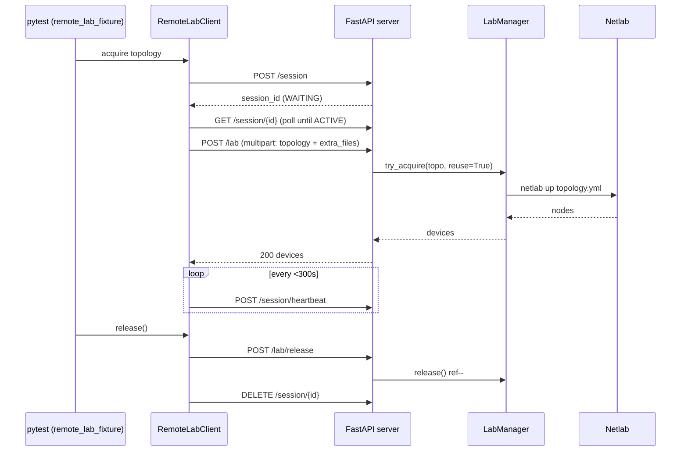
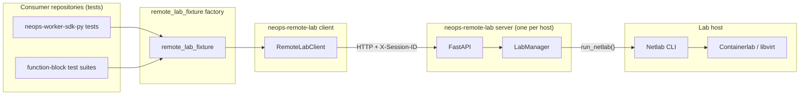

# Architecture

Only a single Netlab topology can run on a host at any given time. When several
developers or CI jobs want to test against the same virtual network, they need a
queue, a heartbeat, and someone to tear the lab down when the last test walks
away. `neops-remote-lab` is that queue.

> **Why a server?** Netlab is a host-local tool. Running it inside each test
> runner would mean one lab per runner — expensive, and it collides with the
> one-lab-per-host rule anyway. A small HTTP service in front of Netlab lets
> many clients share one lab host safely.

## Three components, one process per host

`neops-remote-lab` ships three pieces that cooperate across the network:

| Component | Runs on | Role |
|---|---|---|
| FastAPI server (`neops_remote_lab.server`) | The lab host | Accepts sessions, queues them FIFO, invokes Netlab for the active session. |
| `LabManager` singleton | In the server process | Tracks the one running lab; enforces the one-lab-per-host rule; reference-counts reuse. |
| `RemoteLabClient` + `remote_lab_fixture` | Your CI / dev machine | Creates a session, heartbeats it, uploads a topology, yields devices to your test, releases on teardown. |

## Request flow: session, then lab

Every `/lab/*` call is gated by two things: a valid `X-Session-ID` header and
that session being the head of the FIFO queue.

<!-- trace: neops_remote_lab/server.py:390 -->
Non-active sessions receive `423 Locked`. The server never shortcuts the queue;
the only way to skip ahead is to wait for the head to release or time out.

`/session/heartbeat` is gated more loosely: it only requires the session to
exist (404 if unknown) and accepts heartbeats from both WAITING and ACTIVE
sessions, which lets a queued client reset its WAITING timeout before it is
promoted. <!-- trace: neops_remote_lab/server.py:488 --> See
[Session queue](20-session-queue.md) for the promotion and timeout rules.

## The one-server-per-host guard

<!-- trace: neops_remote_lab/__main__.py:104 -->
At startup the entrypoint acquires a non-blocking `FileLock` under the system
temp directory. If a second instance tries to start on the same host, the lock
fails immediately and the new process logs the owner's PID, user, host, bind
address, and the command that started it — then exits with status 1.

!!! warning "Stale locks after a crash"
    If a previous server crashed without running its cleanup, the lock file may
    remain. The entrypoint detects this by reading the companion metadata file
    and probing whether the recorded PID is still alive; when the PID is gone
    it clears the stale metadata and proceeds. If both are stuck (live PID for a
    process that is actually hung), kill the PID manually. See
    [Administration](../30-server/30-administration.md).

## The one-lab-per-host guard

<!-- trace: neops_remote_lab/netlab/lab_manager.py:43 -->
Netlab itself can only manage one topology at a time per host. `LabManager` is
a classmethod-only singleton; its state lives on the class, and a
system-wide `FileLock` under the temp directory serialises access across any
additional Python processes (e.g. local tests running alongside the server).

> **Why both?** The singleton prevents two async tasks in the server from
> racing. The `FileLock` prevents a developer from accidentally running a local
> `netlab` process in parallel with the server on the same host.

## Long Netlab calls don't block the queue

Netlab commands take minutes: they build containers, boot routers, and install
configurations. The server runs them off the event loop so the rest of the API
— heartbeats, status polls from other sessions, health checks — keeps
responding while a `netlab up` is in flight. The mechanics are documented for
contributors in
[Invariants & Internals](../50-contributing/20-invariants.md#async-and-blocking-discipline).

## How Netlab is invoked

<!-- trace: neops_remote_lab/netlab/connector.py:85 -->
There is exactly one path to the Netlab CLI: `run_netlab` in
`neops_remote_lab.netlab.connector`. It builds the argv as
`["netlab", *args]`, runs the subprocess, and streams or captures stdout
depending on the `NEOPS_NETLAB_STREAM_OUTPUT` env var. Never shell out to
`netlab` from anywhere else in the codebase — the concentrator gives us
uniform logging, error handling, and the `expected_failure` flag for silent
cleanup attempts.

## Ecosystem position

`remote_lab_fixture` is the **stable public API**. Consumer repositories —
notably the [Worker SDK](https://docs.neops.io/neops-worker-sdk-py/docs/),
which uses it to give [function-block](https://docs.neops.io/neops-worker-sdk-py/docs/function-blocks/)
tests a real topology
([integration guide](https://docs.neops.io/neops-worker-sdk-py/docs/testing/30-remote-lab/)) —
import it directly and treat its call signature as a contract. Changing its
arguments is a breaking change. The REST surface and `RemoteLabClient` are
lower-level and may evolve more freely, but the fixture uses them both, so any
incompatible change is detected immediately by the fixture's own tests.

!!! info "No HTTP authentication"
    The `X-Session-ID` header is the only access boundary on `/lab/*`
    (ACTIVE sessions only; non-active sessions receive `423 Locked`).
    `/session/heartbeat` accepts any session that exists — WAITING or
    ACTIVE — and is not part of the ACTIVE gate. Deploy this service on an
    internal-trust network only — the Headscale/Tailscale setup under
    [Headscale VPN](../40-deployment/20-headscale-vpn.md) is the expected
    enclosure.

## Where to go next

- [Session queue](20-session-queue.md) — FIFO promotion, heartbeats, and the
  stale-session sweep that keeps a crashed client from blocking the queue.
- [Lab lifecycle](30-lab-lifecycle.md) — SHA-based topology identity, reference
  counting, the `try_acquire` vs `acquire` distinction, and `atexit` teardown.
- [Topology format](40-topology-format.md) — the YAML shape, vendor
  defaults, and the `extra_files` upload contract.
