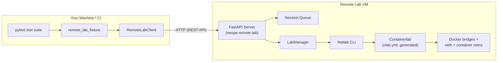

# Architecture

Remote Lab is split into two components that communicate over HTTP: a **server** that manages Netlab on a remote VM, and a **client** (with pytest fixtures) that runs wherever your tests run.

## Components



Netlab is an orchestration layer, not the runtime. Given a user-supplied Netlab YAML, `netlab up` transforms the topology into a Containerlab file (`clab.yml`) inside the lab working directory, then invokes `containerlab deploy` to actually run the containers. Remote Lab never generates `clab.yml` directly -- it only hands the Netlab YAML to `netlab`.

Containerlab provisions the actual containers, networks, and wiring. Management addresses that Remote Lab returns via `DeviceInfoDto.raw` come from a Docker bridge that Containerlab sets up; see [Headscale VPN](../50-deployment/20-headscale-vpn.md) for how peer machines reach that subnet. Upstream references: [Netlab](https://netlab.tools), [Containerlab](https://containerlab.dev) (also listed on the [Resources](../99-appendix/resources.md) page).

??? info "Containerlab provisioning details"
    For Netlab's `clab` provider, Containerlab uses a Docker bridge named `clab-mgmt` on the subnet `192.168.121.0/24` by default. Each node becomes a container with its own network namespace, and Containerlab wires point-to-point veth pairs for every link declared in the topology. These details matter when configuring VPN routing or debugging container reachability — see [Topology Format](40-topology-format.md) for what Remote Lab does and does not configure.

### Server

The server is a FastAPI application (`neops_remote_lab/server.py`) that runs on a VM where Netlab and Containerlab are installed. It manages:

- A **session queue** that serializes access so only one client uses the lab at a time (see [Session Queue](20-session-queue.md))
- A **`LabManager`** class-only state container (all state lives in class-level attributes; no instances are created) that orchestrates Netlab topology lifecycle -- start, reuse, teardown (see [Lab Lifecycle](30-lab-lifecycle.md))
- **Stale session cleanup** via an adaptive background task
- **Startup cleanup** of any stale Netlab instances left by a previous crash

The server is started with `neops-remote-lab --host 0.0.0.0 --port 8000`. Only one server instance may run per host, enforced by a `filelock` guard in `__main__.py`.

### Client

The client side has two layers:

1. **`RemoteLabClient`** (`neops_remote_lab/client.py`) -- a session-aware HTTP client that handles session creation, queue polling, lab acquisition, heartbeats, and cleanup. It wraps `requests.Session` with retry logic and timeout configuration.

2. **`remote_lab_fixture`** (`neops_remote_lab/testing/fixture.py`) -- a factory function that produces pytest fixtures. Each fixture declares a topology file and whether the lab can be reused. The fixture depends on a session-scoped `remote_lab_client` fixture that manages the HTTP connection.

The client is consumed by **neops-worker-sdk-py**, which imports `remote_lab_fixture` directly to declare lab fixtures for integration tests. The `remote_lab_fixture` call signature is a stable public API.

## Request Flow

When a pytest test that uses a remote lab fixture runs, the request flows through these layers:

```
pytest collects test
  → fixture function calls remote_lab_client.acquire(topology, reuse=True)
    → RemoteLabClient.acquire() sends POST /lab with topology file
      → FastAPI server receives multipart upload
        → server validates X-Session-ID header (must be ACTIVE)
        → server saves topology to temp directory
        → server calls LabManager.try_acquire(topo, reuse=reuse)
          → LabManager computes SHA-256 of topology content
          → LabManager decides: start new lab, reuse existing, or return None (busy)
            → if starting: run_netlab(["up", topo.name], cwd=workdir)
              → Netlab CLI brings up Containerlab topology
            → if reusing: increment ref_count, return existing devices
      → server returns device list to client
    → RemoteLabClient returns list[DeviceInfoDto]
  → fixture yields device list to test
```

After the test completes, the fixture calls `remote_lab_client.release()`, which sends `POST /lab/release` to decrement the reference count. When the test session ends, `remote_lab_client.close()` sends `DELETE /session/{id}` to clean up.

## Trust Model

Remote Lab operates on an **internal trust model** -- there is no authentication. The `REMOTE_LAB_TOKEN` / Bearer auth code path in `client.py` is fully commented out, no `token` constructor argument exists, and the server has no corresponding handler. Treat the variable name as a placeholder, not as active auth.

The only access boundary is the `X-Session-ID` header:

- All `/lab/*` endpoints and `/session/heartbeat` require an `X-Session-ID` header
- The header value must belong to a session in the `ACTIVE` state
- Non-active sessions receive `423 Locked`
- Session IDs are UUID v4 values, generated server-side

This means the server should only be exposed on trusted networks -- behind a VPN or on an internal subnet. It is not designed for public-facing deployment.

## One-Lab-Per-Host Constraint

Netlab supports only a single running topology per host. Remote Lab enforces this at three levels:

1. **Process-wide**: `LabManager` is a class-only state container -- `_current_topo`, `_current_topo_hash`, and `_handle` are class attributes, not instance attributes; the class is never instantiated. There is exactly one active lab handle at any time.

2. **Cross-process (lab-lifecycle lock)**: `GLOBAL_LOCK` is a `filelock.FileLock` at `<tempdir>/netlab_pytest.lock` (declared in `neops_remote_lab/netlab/lab_manager.py`). It serializes lab-lifecycle operations -- `try_acquire()`, `release()`, `_terminate_current()`, and `cleanup()` -- across all processes that touch `LabManager`, including multiple pytest worker processes.

3. **Single-instance lock (server-process lock)**: A separate `filelock.FileLock` at `<tempdir>/neops_remote_lab_server.lock` (acquired in `neops_remote_lab/__main__.py`) prevents two Remote Lab server processes from running on the same host. On collision it logs the conflicting PID, user, and host. This lock is independent of `GLOBAL_LOCK` -- the two protect different invariants and live in different files.

??? info "Why not multiple labs?"
    Netlab itself uses a single "default" instance internally. Running `netlab up` while another topology is active produces an error: *"It looks like the lab instance 'default' is already running."* The Remote Lab server works within this limitation rather than trying to circumvent it, which keeps the architecture simple and the failure modes predictable.
