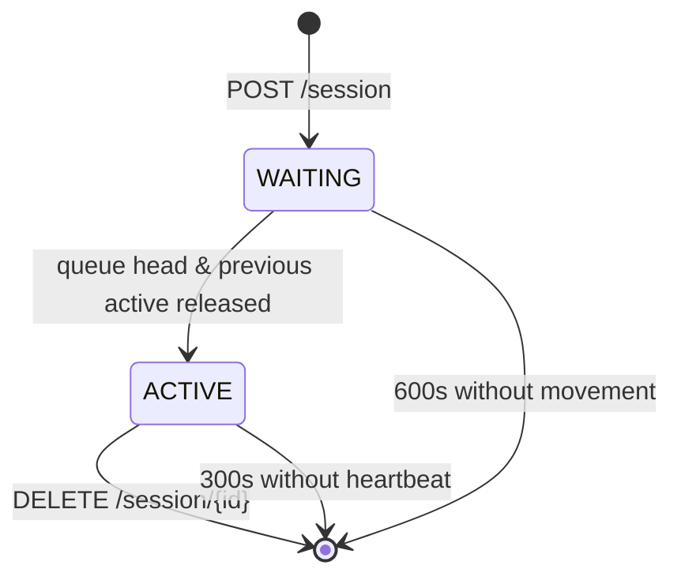

# Session Queue

FIFO. That's the whole queue. New sessions go to the tail; the head is whoever can talk to Netlab right now; everyone else polls until promotion. The state machine, the heartbeats, and the eviction timeouts below are all implementations of that one rule.

## The state machine

Every session is in exactly one of two states:



The queue itself is a plain Python list in the server process; the head is the
ACTIVE session (if any), and the rest are WAITING in insertion order.

## Creating a session

<!-- trace: neops_remote_lab/server.py:292 -->
`POST /session` generates a UUID, appends it to the queue, and immediately
invokes the promotion helper. If the queue was empty the new session is
promoted to ACTIVE before the response returns; otherwise it stays WAITING at
the tail of the queue and the response reports its position.

```bash
curl -s -X POST http://$LAB_HOST:8000/session
```

```json
{"session_id":"c3f1a9e2-...-b7","position":0}
```

Position 0 means ACTIVE. Any higher number is the number of sessions ahead of
you in line.

## Promotion order

<!-- trace: neops_remote_lab/server.py:185 -->
The queue head moves forward by one when the current ACTIVE session releases.
If a client three places back gets impatient and `DELETE`s its session, that
slot is removed without rearranging anyone else's position.

> **Why no priority scheme?** A priority queue needs a reason to prefer one
> test over another. None of the consumer projects — most importantly the
> [Worker SDK](https://docs.neops.io/neops-worker-sdk-py/docs/) — surface
> that intent to the server, so the server doesn't try to guess.
> First-come, first-served is the only fair default.

## The access boundary

<!-- trace: neops_remote_lab/server.py:390 -->
Every `/lab/*` endpoint is gated by a dependency that looks up the
`X-Session-ID` header, confirms the session exists, and checks that its
status is `ACTIVE`. A missing header fails schema validation (422); an
unknown session returns 404; a known but WAITING session returns
`423 Locked`.

<!-- trace: neops_remote_lab/server.py:482 -->
`/session/heartbeat` does **not** share that dependency. It is declared
with a plain `Header(...)` parameter and only checks that the session
exists (404 if unknown), which is why a client can heartbeat while still
WAITING in the queue. See [The heartbeat](#the-heartbeat) below for why
that matters.

!!! danger "ACTIVE-session gating is the only access control"
    This is the sole access boundary on the lab surface. There is no Bearer
    token, no mTLS, no tenant header. Run the server behind a VPN or on a
    trusted internal network — treat an exposed port as equivalent to giving
    the internet root access to your lab host.

## The heartbeat

An ACTIVE session must prove it is still alive. The fixture and
`RemoteLabClient` do this automatically; any other caller has to do it by
hand.

<!-- trace: neops_remote_lab/server.py:481 -->
`POST /session/heartbeat` with `X-Session-ID: <id>` updates the session's
`last_seen_at` timestamp and returns 204. It works for both WAITING and ACTIVE
sessions (the state gate is only on `/lab/*`).

```bash
curl -X POST http://$LAB_HOST:8000/session/heartbeat \
     -H "X-Session-ID: $SESSION"
```

```
HTTP/1.1 204 No Content
```

??? info "What counts as a heartbeat?"
    Calls to `GET /session/{id}`, `GET /active-session`, `GET /lab`,
    `GET /lab/devices`, `POST /lab`, `POST /lab/release`, and
    `DELETE /lab` all update `last_seen_at` on their way through. In
    practice any real activity keeps the session alive; the dedicated
    heartbeat endpoint is the cheapest option for long-running tests that
    aren't touching the lab API.

## Stale-session eviction

A crashed client cannot unregister itself. The server has two timeouts to keep
the queue from deadlocking.

<!-- trace: neops_remote_lab/server.py:95 -->
A WAITING session is dropped after 600 seconds of no activity. An ACTIVE
session is deemed stale after 300 seconds without a heartbeat.

| State | Timeout | Why this value |
|---|---|---|
| WAITING | 600s | `netlab up` can take minutes; a slow queue ahead is not a client bug. |
| ACTIVE | 300s | Short enough that a crashed test releases the lab promptly; long enough that normal test setup doesn't trigger it. |

<!-- trace: neops_remote_lab/server.py:259 -->
When an ACTIVE session is evicted, the server runs `LabManager.cleanup` to
tear down the lab, then promotes the next WAITING session to ACTIVE. The
incoming test will see a fresh lab — not the evicted session's.

## The cleanup loop cadence

<!-- trace: neops_remote_lab/server.py:275 -->
The background cleanup task is adaptive: it runs every 5 seconds when the
queue has multiple sessions, every 15 seconds when exactly one ACTIVE session
is present, and every 30 seconds when the queue is empty. This keeps stale
sweeps responsive under contention without burning CPU on an idle host.

## Ending a session cleanly

`DELETE /session/{id}` removes the session from the queue and, if it was
ACTIVE, triggers `LabManager.cleanup` and promotes the next session. No
`X-Session-ID` header is required — anyone with the session ID can end it.

```bash
curl -X DELETE http://$LAB_HOST:8000/session/$SESSION
```

```
HTTP/1.1 204 No Content
```

## Polling from a client's perspective

```bash title="examples/curl/poll_until_active.sh"
--8<-- "examples/curl/poll_until_active.sh"
```

Expected sequence during a busy queue:

```
{"status":"waiting","position":2}
{"status":"waiting","position":1}
{"status":"active","position":0}
```

`RemoteLabClient` does this automatically with exponential backoff on
retriable errors. See [RemoteLabClient](../20-client/20-python-client.md).

## Queue contention under CI load

When multiple runners point at one Remote Lab server, each creates its own session and enters the FIFO queue. The server promotes exactly one session to ACTIVE at a time; everyone else waits.

**What each client does while waiting:**

<!-- trace: neops_remote_lab/client.py:197 -->

- On `POST /lab`, if the server returns `423 Locked` (another session holds the lab with a different topology), `RemoteLabClient.acquire()` sleeps 5 s and retries in a loop. The loop is bounded by `lab_acquisition_timeout` (default 600 s / `REMOTE_LAB_ACQUISITION_TIMEOUT`); after that the client raises.
- While the session is still `WAITING` in the queue, `GET /session/{id}` polls every 5 s until promotion. The poll itself refreshes `last_seen_at`, so polling waiters do not go stale.

### Choosing CI concurrency

For `N` concurrent runners all expecting to run tests against one server, the back-of-envelope queue-depth worst case is:

```
queue_depth_wait ≈ N × (avg_lab_hold_time + teardown_cost)
```

If `avg_lab_hold_time + teardown_cost` is 5 minutes and you run 8 concurrent jobs, the 8th job waits up to ~40 minutes. Compare to the server's `_WAITING_SESSION_TIMEOUT` (600 s) — if the tail wait exceeds that, the server drops the session and your client sees a timeout error. Two ways out:

1. **Lower concurrency** to keep the worst-case wait under `_WAITING_SESSION_TIMEOUT`.
2. **Raise both timeouts together** — client `REMOTE_LAB_SESSION_TIMEOUT` and server `_WAITING_SESSION_TIMEOUT` must agree (the server-side constant is at the moment a code change, not a knob; coordinate with the operator).

### Shared topologies collapse the queue

If multiple CI jobs target the **same** topology with `reuse=true`, they do **not** serialize on `netlab up` — the server reuses the running lab and acquire becomes a refcount increment. **This is the single biggest contention mitigation.** A fleet of 20 tests sharing one topology pays Netlab boot cost once and queues only at the session layer (which is much cheaper). See [Pytest Fixtures → reuse](../20-client/10-pytest-fixtures.md) for the fixture-level switch and [Lab Lifecycle → Reuse](30-lab-lifecycle.md#reuse-the-refcount-increments) for the underlying mechanism.

### Per-request timeout, not wall-clock

`REMOTE_LAB_ACQUISITION_TIMEOUT` is passed as the `timeout=` kwarg on each individual `POST /lab` call (`client.py:192`); it is **not** a wall-clock bound on the `while True:` 423-retry loop. A loaded server that returns `423 Locked` quickly will make the client spin forever at 5-second intervals. To fail fast, wrap the acquire in a pytest-level timeout or use CI-level job timeouts (see [CI quickstart](../getting-started/40-ci-quickstart.md)).

## Common pitfalls

!!! warning "Don't send heartbeats faster than every few seconds"
    The heartbeat is cheap but not free. Polling aggressively in a tight loop
    can mask a real bug (your test never actually invoked the lab endpoints)
    and floods the server logs. The fixture sends on a sensible schedule; if
    you're writing a custom client, aim for every 60-120 seconds.

!!! warning "Don't assume position is stable"
    Your reported `position` can jump around if sessions ahead of you get
    evicted or cancelled. Only `status == "active"` is a guarantee you can
    drive the lab.

## Where to go next

- [Lab lifecycle](30-lab-lifecycle.md) — what happens after promotion:
  uploading a topology, reuse semantics, and release.
- [Architecture](10-architecture.md) — how this queue sits inside the broader
  server + client topology.
