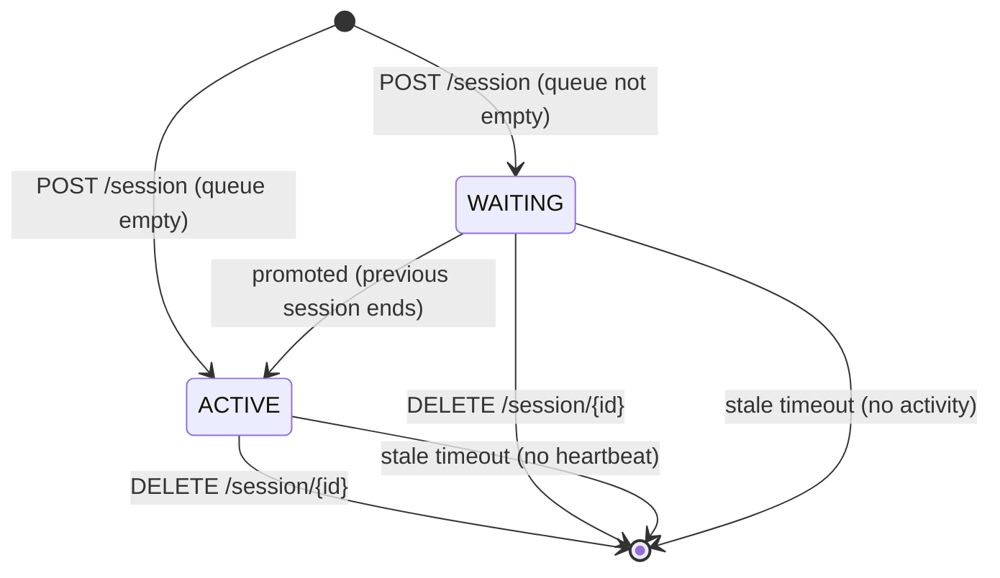
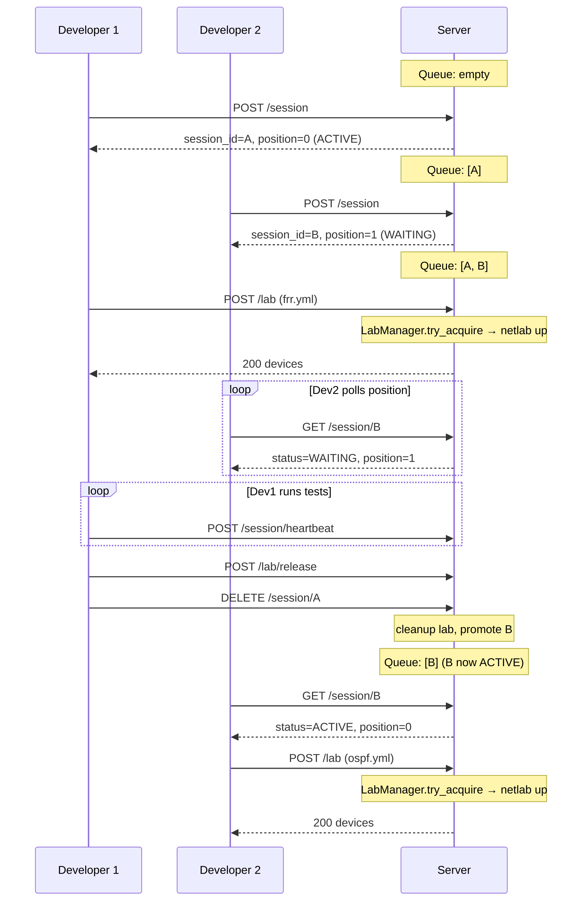

# Session Queue

The session queue is the mechanism that serializes access to the lab. Because only one Netlab topology can run per host, the queue ensures that clients take turns in a predictable, first-come-first-served order.

## Session States

A session has exactly two possible states, defined by `SessionState` in `neops_remote_lab/models/session.py`:



- **`WAITING`** -- the session is in the queue behind other sessions. The client polls `GET /session/{id}` to check its position.
- **`ACTIVE`** -- the session is at the head of the queue and may interact with lab endpoints (`POST /lab`, `GET /lab`, `POST /lab/release`, etc.).

There is no `COMPLETED` or `ERROR` state. Sessions are simply removed from the tracking structures when they end or time out.

## FIFO Semantics

The queue is implemented as a Python list (`_SESSION_QUEUE` in `server.py`) where the element at index 0 is always the active session. New sessions are appended to the end.

The position reported in API responses corresponds directly to the list index:

- **Position 0** = active session (always `ACTIVE` state)
- **Position 1** = next in line
- **Position N** = N sessions ahead

The queue order never changes -- sessions cannot jump the line. When a session is removed (by the client or by cleanup), subsequent sessions shift forward automatically.

## Promotion Logic

Promotion is handled by `_promote_if_needed()`, which runs after any event that could create a vacancy at the head of the queue:

1. A client calls `DELETE /session/{id}` to end an active session
2. A stale session is removed by the cleanup task
3. Server startup cleans up leftover sessions

The logic is defensive:

```
while queue is not empty:
    look at first element
    if it has no session record → pop it (orphan cleanup) and repeat
    if it is already ACTIVE → done
    if it is WAITING → promote to ACTIVE, done
```

This means promotion always happens synchronously as part of the operation that created the vacancy -- there is no separate promotion worker or async delay.

## Heartbeat Mechanism

Active sessions must send periodic heartbeats to prove they are still alive. The heartbeat endpoint (`POST /session/heartbeat`) updates the `last_seen_at` timestamp on the session.

- The `X-Session-ID` header identifies which session is heartbeating
- The endpoint returns `204 No Content` on success
- Any session (active or waiting) can heartbeat, but only active sessions are subject to stale detection based on heartbeat inactivity

The `RemoteLabClient` does not send heartbeats automatically -- the pytest fixture layer or the consuming application is responsible for keeping the session alive during long operations. In practice, the `remote_lab_client` fixture's acquire/release calls and session status polls act as implicit heartbeats since every request to the server updates `last_seen_at`.

??? info "Polling also refreshes the session"
    `GET /session/{id}` also updates `last_seen_at`, so a waiting client that polls its position is implicitly heartbeating. This is why waiting sessions rarely time out under normal usage -- the client's poll loop keeps them fresh.

## Stale Session Detection

A background task (`_cleanup_loop_async`) periodically scans all sessions and removes any that have gone stale. The timeouts differ by state:

| State | Timeout | Rationale |
|-------|---------|-----------|
| `WAITING` | 600 seconds | Netlab `up` can take minutes; waiting sessions need patience |
| `ACTIVE` | 300 seconds | An active session that stops heartbeating is likely crashed |

When a stale active session is removed:

1. The session is deleted from `_SESSIONS` and `_SESSION_QUEUE`
2. `LabManager.cleanup()` tears down the running lab
3. `_promote_if_needed()` promotes the next waiting session

When a stale waiting session is removed, only steps 1 applies -- there is no lab to clean up for a session that never became active.

### Adaptive Cleanup Interval

The cleanup task does not run on a fixed schedule. It adapts its sleep interval based on current load to avoid unnecessary work when idle and respond quickly when busy:

| Condition | Interval | Multiplier |
|-----------|----------|------------|
| Busy (multiple sessions) | ~5 seconds | `_SESSION_CLEANUP_INTERVAL * 1` |
| Single active session | ~15 seconds | `_SESSION_CLEANUP_INTERVAL * 3` |
| Idle (no sessions) | ~30 seconds | `_SESSION_CLEANUP_INTERVAL * 6` |

The base interval `_SESSION_CLEANUP_INTERVAL` is defined as `5` seconds in `server.py`.

## Multi-User Scenario

Here is what happens when two developers (or CI jobs) try to use the lab at the same time:



Developer 2 waits transparently. The `RemoteLabClient._wait_for_active_session()` method handles this with a configurable timeout (default 600 seconds), polling every 5 seconds with exponential backoff on transient errors.

## API Endpoints

For complete endpoint documentation including request/response schemas and status codes, see the [REST API Reference](../20-server/10-rest-api.md).

| Endpoint | Purpose |
|----------|---------|
| `POST /session` | Create a new session (enters queue) |
| `GET /session/{id}` | Check session status and queue position |
| `GET /active-session` | Get the currently active session |
| `DELETE /session/{id}` | End a session (triggers promotion) |
| `POST /session/heartbeat` | Keep a session alive (`X-Session-ID` header) |
