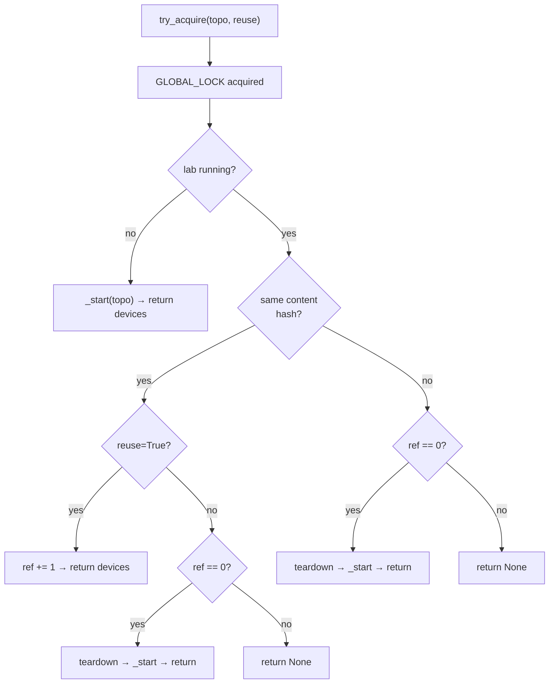

# Lab lifecycle

*Identify, decide, reuse-or-start, count. The bookkeeping that makes "many tests, one lab" work.*

When a test asks for a lab, four things happen in order:

1. **Identify** the topology (by content hash, not filename).
2. **Decide** whether an existing lab can be reused.
3. **Reuse** the running lab or **start a fresh one**.
4. **Count** the acquisition so nothing tears the lab down while it's
   still in use.

`LabManager` encapsulates that bookkeeping.

> **Why reference counting?** Many tests need the *same* topology. Spinning
> it up once and letting several clients share it turns a 5-minute Netlab
> boot into a one-time cost per test session. But sharing has to be opt-in
> (a test that mutates device configs shouldn't silently collide with a
> reader), and the last user has to know it's the last user. That's what the
> ref counter tracks.

## Topology identity is content, not filename

<!-- trace: neops_remote_lab/netlab/lab_manager.py:129 -->
When `LabManager._start` receives a topology it hashes the file content with
SHA-256 and stores the digest in `_current_topo_hash`. Every subsequent
acquire request hashes its own candidate topology and compares digests.

Two files called `simple_frr.yml` and `frr_reused.yml` with byte-identical
contents are therefore the same topology: a reuse request from one succeeds
against a lab started by the other.

!!! tip "This lets you copy topologies without fragmenting reuse"
    A test helper that copies a vendored topology into each test's workdir
    still gets reuse for free, as long as the content is unchanged. The
    filename is purely cosmetic.

## try_acquire vs acquire

The server uses a non-blocking `try_acquire`; local-test fixtures use a blocking-poll `acquire`. Mixing them deadlocks. See [Contributing → LabManager singleton & locking](../50-contributing/40-internals-lab-manager.md#try_acquire-vs-acquire) for the contract.

## The decision tree



*`try_acquire` decision tree — content hash and refcount decide every branch.*

## Reuse: the refcount increments

<!-- trace: neops_remote_lab/netlab/lab_manager.py:190 -->
When the topology content hashes match and the caller sets `reuse=True`,
`LabManager` increments the handle's `ref` counter and hands back the
existing device list. Netlab is not invoked — the running containers are
already up, so the call returns in milliseconds.

Expected log line on a reuse:

```
Re-using lab simple_frr.yml (ref=2)
```

The same lab can fan out to as many concurrent sessions as the queue allows.
In the REST surface this is driven by `reuse=true` on the multipart upload;
on the fixture side it's the `reuse_lab=True` keyword.

## Release: the refcount decrements

<!-- trace: neops_remote_lab/netlab/lab_manager.py:251 -->
`release` (or the server's `release_current` wrapper) decrements the
counter. Crucially, **hitting zero does not tear the lab down**. The lab
becomes "idle": still running, still responsive on its management
interfaces, but unowned. The next acquire decides its fate.

| Next event | Outcome |
|---|---|
| Same-content acquire with `reuse=True` | Lab is reused; refcount goes from 0 to 1. |
| Same-content acquire with `reuse=False` | Current lab is torn down, fresh lab started with the same content. |
| Different-content acquire | Current lab is torn down (topology switch), new lab started. |
| Interpreter exits | `atexit` handler tears the lab down. |
| Session stale timeout | Server runs `LabManager.cleanup`, lab is torn down. |

??? info "Why idle and not teardown?"
    Keeping an idle lab running is cheap (the containers are already
    booted). Tearing it down and restarting it on the very next test is
    expensive. The policy trades a few seconds of idle CPU for not paying
    Netlab boot cost repeatedly in a tight run.

## Topology switch: tear down, spin up

<!-- trace: neops_remote_lab/netlab/lab_manager.py:202 -->
When a caller requests a topology whose content differs from the current
one, the switch is only allowed if the current refcount is zero. If the
current lab is in use, the caller gets `None` back and has to wait. When
the current lab is idle, `_terminate_current` runs `netlab down --cleanup`
and `_start` brings up the new topology.

```
Switching topology from simple_frr.yml to spine_leaf.yml
Starting lab spine_leaf.yml - this may take several minutes...
```

## atexit is the last safety net

<!-- trace: neops_remote_lab/netlab/lab_manager.py:327 -->
`LabManager` registers a cleanup function with `atexit.register`. When the interpreter exits — normally or because pytest crashed — this hook runs and tears down any lab that is still up. A test that raises before reaching its `finally` block may never call release; `atexit` catches it.

For the contributor view of why this path stays synchronous and silent, see [Internals: atexit + lifespan](../50-contributing/50-internals-atexit.md#atexit-teardown) before changing it.

An ACTIVE session must heartbeat — see [Session Queue → The heartbeat](20-session-queue.md#the-heartbeat) — or the lab gets reaped from under it.

## Long-running CI host sanity check

<!-- trace: neops_remote_lab/netlab/lab_manager.py:125 -->
Before starting any new lab, `_start` forcibly runs `netlab down --instance default --cleanup` to reclaim a stale default instance left over from a crashed prior job. The call is made with `expected_failure=True`, so when no default instance exists it's a silent no-op.

For the operator's view of the same cleanup at server startup time, see [Administration → Starting the server](../30-server/10-administration.md#starting-the-server).

## Where to go next

- [Topology format](40-topology-format.md) — what goes inside the YAML
  file, and what `extra_files` can deliver alongside it.
- [Session queue](20-session-queue.md) — how session promotion and
  eviction drive the lifecycle transitions above.
- [Architecture](10-architecture.md) — where `LabManager` fits in the
  overall request flow.
