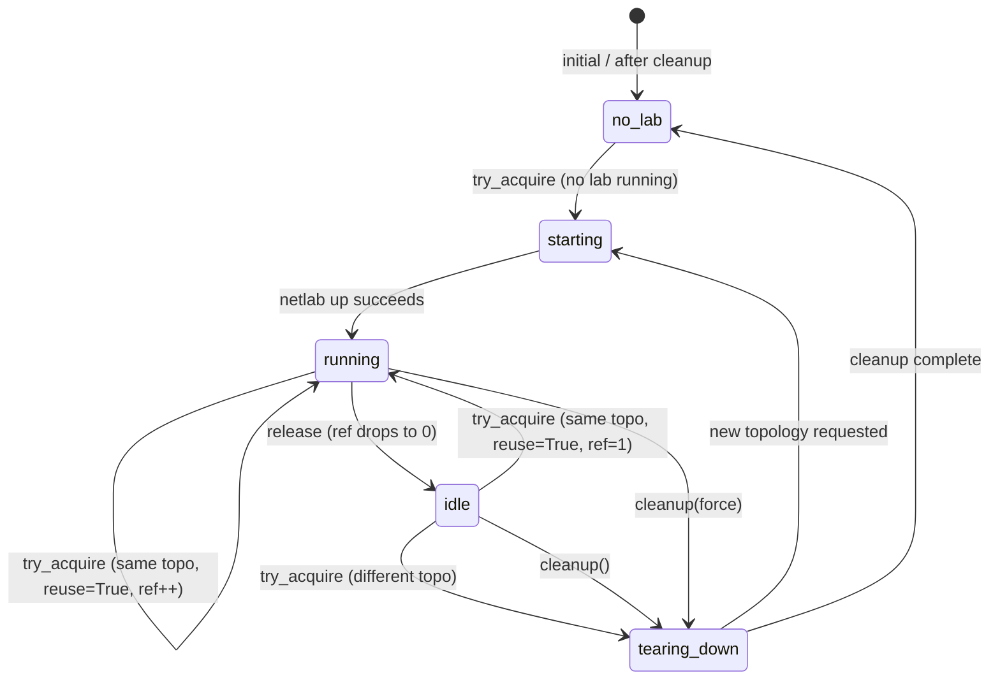

# Lab Lifecycle

`LabManager` controls the lifecycle of Netlab topologies. It enforces the one-lab-per-host rule, supports lab reuse across tests that share the same topology, and handles teardown through reference counting.

## Lab States

A lab transitions through these states:



Key transitions:

- **No lab → starting**: `try_acquire()` is called when no lab exists. The manager copies the topology to a temp directory and runs `netlab up`.
- **Running → running (reuse)**: Another test requests the same topology with `reuse=True`. The reference count increments and the existing device list is returned -- no Netlab commands execute.
- **Running → idle**: `release()` decrements the reference count to zero. The lab remains running but is not actively used.
- **Idle → running**: A new test picks up the idle lab for the same topology. The reference count goes back to 1.
- **Idle → tearing down**: A different topology is requested, or `cleanup()` is called. The current lab is torn down with `netlab down --cleanup` before the new one starts.

## Topology Identity

Two topology files are considered identical if their **SHA-256 content hashes** match, regardless of filename. This is computed by `_compute_file_sha256()` which reads the file in chunks for memory efficiency.

```python
# Simplified from lab_manager.py
new_hash = _compute_file_sha256(topo)
if cls._current_topo_hash == new_hash:
    # Same topology content — eligible for reuse
```

This means:

- `simple_frr.yml` and `my_frr_copy.yml` with identical content are the same topology
- Renaming a file does not force a lab restart
- Any change to file content (even whitespace) produces a different hash and triggers a fresh lab

The topology file must have a `.yml` extension. The HTTP surface accepts `.yaml` uploads, but `LabManager` internally enforces `.yml` via `prepare_workdir()`. For the full envelope — supported providers, modules, device kinds, and the `extra_files` mechanism — see [Topology Format](40-topology-format.md).

## Reference Counting

When a lab is acquired with `reuse=True`, the manager tracks how many clients are using it via a reference count (`_Handle.ref`):

| Event | Effect on ref_count |
|-------|-------------------|
| `try_acquire()` starts a new lab | ref = 1 |
| `try_acquire()` reuses existing lab | ref += 1 |
| `release()` | ref -= 1 |
| ref reaches 0 | Lab becomes **idle** (still running) |
| `cleanup()` or different topology requested | Lab torn down regardless of ref |

The reference count prevents premature teardown. If two tests share a topology, the first test's `release()` drops the count to 1, and the lab stays running for the second test.

??? info "What happens when ref underflows?"
    `LabManager.release()` includes a guard against reference counter underflow. If `ref` drops below zero (which should not happen in normal operation), it logs an error and clamps the value to 0. This is defensive coding -- it indicates a bug in the caller, not in the manager.

### Reuse vs. Exclusive Access

The `reuse` parameter on `try_acquire()` controls whether a test is willing to share a running lab:

- **`reuse=True`** (default): If the same topology is already running, increment the ref count and return the existing devices. This is fast -- no Netlab commands run.
- **`reuse=False`**: The caller wants an exclusive lab. If a lab is running for the same topology, `try_acquire()` returns `None` (busy) until the current lab's ref count drops to zero. Then the manager tears down and starts fresh.

In the server context, `try_acquire()` returning `None` causes the endpoint to respond with `423 Locked`, and the client retries.

## Cross-Process Locking

Netlab's one-lab rule is not just per-process -- it is per-host. If multiple pytest workers or processes try to manage labs concurrently, they would collide. `LabManager` uses a `FileLock` to serialize access:

```python
GLOBAL_LOCK = FileLock(str(Path(tempfile.gettempdir()) / "netlab_pytest.lock"))
```

The lock is acquired during:

- `try_acquire()` -- the entire decision + start/reuse logic runs under the lock
- `release()` -- ref count decrement is atomic with respect to other processes
- `_terminate_current()` -- teardown is exclusive
- `cleanup()` -- wraps `_terminate_current()` or `_terminate_default_netlab_instance()`

The lock file lives in the system temp directory (e.g., `/tmp/netlab_pytest.lock`). A stale lock from a crashed process must be manually removed -- see [Administration](../20-server/30-administration.md) for troubleshooting.

## acquire() vs. try_acquire()

`LabManager` exposes two acquisition methods for different contexts:

| Method | Blocking | Returns | Used by |
|--------|----------|---------|---------|
| `try_acquire(topo, reuse=)` | No | `list[DeviceInfoDto]` or `None` | Server (async HTTP handler) |
| `acquire(topo, reuse=)` | Yes (polls) | `list[DeviceInfoDto]` | Local test fixtures |

**`try_acquire()`** is non-blocking. It returns `None` immediately if the lab is busy (another topology is running with ref > 0, or the same topology is running but `reuse=False`). The server translates `None` into a `423 Locked` response.

**`acquire()`** is a blocking wrapper that calls `try_acquire()` in a loop, sleeping `WAIT_INTERVAL` (2 seconds) between attempts until the lab becomes available. This is appropriate for local test fixtures where blocking the test runner is acceptable.

Using the wrong method in the wrong context causes problems:

- `acquire()` in an async handler blocks the event loop -- the server becomes unresponsive
- `try_acquire()` in a local fixture returns `None` with no retry -- the test fails immediately

The server wraps `try_acquire()` in `_run_blocking()` to run it on the thread-pool executor, keeping the FastAPI event loop free.

## Cleanup

Labs are cleaned up through several paths:

### Normal Cleanup

When a client ends its session (`DELETE /session/{id}`), the server calls `LabManager.cleanup()` which runs `netlab down --cleanup` in the lab's working directory, then removes the temp directory.

### Stale Session Cleanup

The background cleanup task in the server detects stale active sessions (no heartbeat for 300 seconds) and calls `LabManager.cleanup()` to tear down the orphaned lab. See [Session Queue -- Stale Session Detection](20-session-queue.md#stale-session-detection).

### Server Startup Cleanup

On startup, the server calls `LabManager.cleanup(default_instance=True)` to tear down any stale Netlab `default` instance left by a previous crash. This handles the case where the server process died without running its shutdown sequence.

### atexit Cleanup

`LabManager` registers an `atexit` handler (`_atexit_cleanup`) that runs `cleanup(silent=True)` when the Python interpreter exits. The `silent=True` flag disables logging to avoid errors from writing to closed streams during interpreter shutdown.

??? warning "No async in atexit"
    The `atexit` cleanup path must be synchronous. Adding async code to this path will deadlock because the event loop is no longer running at interpreter exit. This is why `_atexit_cleanup` calls `LabManager.cleanup()` directly rather than going through the server's `_run_blocking()` helper.

### Server Shutdown

During graceful shutdown (SIGTERM/SIGINT), the server's `lifespan` context manager iterates over remaining sessions, calls `_delete_session()` for each, and finishes with `LabManager.cleanup()`. This ensures no orphaned labs survive a clean server stop.

## Workdir Management

Each lab run gets its own temporary working directory created by `prepare_workdir()`:

1. A temp directory is created with prefix `netlab_topo_{stem}_` (e.g., `netlab_topo_simple_frr_abc123`)
2. The topology `.yml` file is copied into the directory
3. Netlab runs in this directory (`cwd=workdir`)
4. On teardown, the entire directory is removed with `shutil.rmtree()`

This isolation ensures that Netlab's generated files (Ansible inventory, Containerlab configs) do not pollute the source repository, and concurrent operations on different topologies do not interfere with each other.
