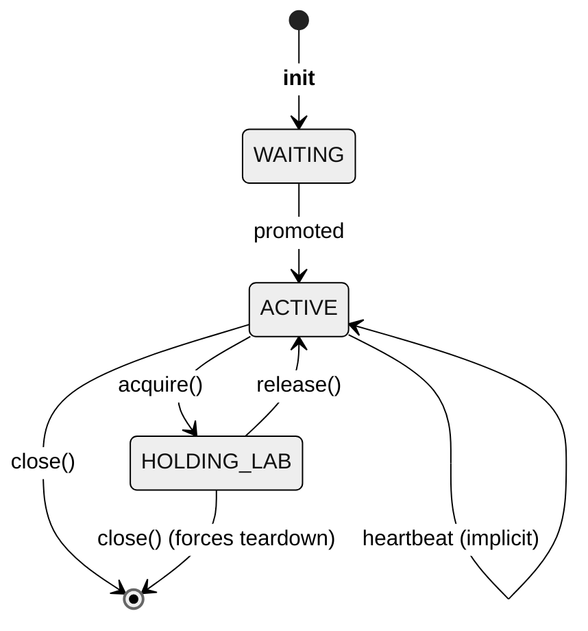

# RemoteLabClient Reference

*The lower-level HTTP client the pytest fixture wraps. Use it directly from scripts, notebooks, or any non-pytest context.*

`RemoteLabClient` is the **Python interface** to the Remote Lab Manager
HTTP API. Use it directly when you need to drive a lab from a script,
a notebook, or any non-pytest context.

*Inside tests, use [`remote_lab_fixture`](10-pytest-fixtures.md)
instead* — the fixture wraps this client, adds lifecycle hooks, and is
the stable contract consumed by the
[Worker SDK](https://docs.neops.io/neops-worker-sdk-py/docs/testing/30-remote-lab/).

---

## Import

```python
from neops_remote_lab.client import RemoteLabClient
```

---

## Constructor

```python
RemoteLabClient(
    base_url: str,
    request_timeout: int = 30,
    session_timeout: int = 600,
    lab_acquisition_timeout: int = 600,
)
```

### Arguments

| Name | Type | Default | Description |
|---|---|---|---|
| `base_url` | `str` | – | Base URL of the Remote Lab Manager (e.g. `http://lab.internal:8000`). If falsy, falls back to the `REMOTE_LAB_URL` environment variable. |
| `request_timeout` | `int` | `30` | Per-HTTP-request timeout in seconds for short operations (create session, release, heartbeat). |
| `session_timeout` | `int` | `600` | Max seconds the constructor will wait for the session to reach ACTIVE state in the FIFO queue. |
| `lab_acquisition_timeout` | `int` | `600` | Max seconds for a single `acquire()` POST. Netlab `up` can take minutes on cold caches, so this is deliberately long. |

### Raises

- **`ValueError`** when `base_url` is falsy AND `REMOTE_LAB_URL` is unset. <!-- trace: neops_remote_lab/client.py:30 -->
- **`TimeoutError`** when the session does not become ACTIVE within `session_timeout` seconds. <!-- trace: neops_remote_lab/client.py:170 -->

### Side effects at construction time

The constructor is not lazy. In order:

1. An HTTP session is created with a retry adapter for 429/5xx responses. <!-- trace: neops_remote_lab/client.py:65 -->
2. A new server session is created via `POST /session` and the returned
   `session_id` is stored on the `X-Session-ID` header of all subsequent
   requests. <!-- trace: neops_remote_lab/client.py:49 -->
3. The constructor blocks, polling `GET /session/{id}` every 5 seconds until
   the session reaches ACTIVE (or `session_timeout` expires). <!-- trace: neops_remote_lab/client.py:170 -->

If the server is unreachable, the constructor will retry (see *Retry behavior*)
and ultimately raise the final `requests` exception.

---

## Session lifecycle

The client follows a strict lifecycle. All `/lab/*` calls are rejected by the
server with `423 Locked` unless the session is ACTIVE, which the constructor
guarantees on return.



The session is kept alive by server-side timers: if no request touches the
session for 300 seconds the server marks it stale, tears down any held lab,
and promotes the next waiter. Call `acquire`/`release`/`destroy` to reset the
heartbeat clock; there is no dedicated heartbeat method on the client —
`neops-remote-lab` server supports `POST /session/heartbeat`, but the Python
client does not expose it, and the pytest fixture does not need it because
the test's own acquire/release traffic keeps the session warm.

---

## Public methods

### `acquire(topology, reuse) -> list[DeviceInfoDto]`

Upload a topology and block until the server has a running lab for you.

```python
def acquire(
    topology: pathlib.Path,
    reuse: bool,
) -> list[DeviceInfoDto]
```

| Argument | Type | Description |
|---|---|---|
| `topology` | `pathlib.Path` | Path to a Netlab `.yml` file. The client opens the file and posts it as multipart form data. |
| `reuse` | `bool` | When `True`, increments the reference count on an already-running lab with the same SHA-256 content identity; when `False`, refuses to start if another lab is already up. |

**Returns** a list of `DeviceInfoDto` describing the running devices. Each DTO
carries `.name` (from Netlab) and `.raw` — the full `netlab inspect` dictionary
for that node. <!-- trace: neops_remote_lab/models/lab.py:23 -->

**Raises** the underlying `requests.exceptions.RequestException` on transport
errors and the standard `HTTPError` subclasses on non-retriable 4xx responses.

**423 polling.** If the server returns `423 Locked` (another session holds
the host), `acquire()` sleeps 5 seconds and retries without user intervention.
There is no retry cap — the loop is bounded only by `lab_acquisition_timeout`
applied to each individual POST. <!-- trace: neops_remote_lab/client.py:195 -->

!!! tip "reuse and SHA identity"
    Topologies are identified by the SHA-256 of their file content, not by
    filename. Two files with different names but identical bytes share one
    lab when `reuse=True`; two files with the same name but different content
    are separate labs. If you edit a topology file between tests, you are
    booting a new lab.

### `release() -> None`

Decrement the server-side reference count on the held lab. When the count
reaches zero the server tears the lab down.

```python
def release() -> None
```

`release()` is tolerant of races — a `404 Not Found` response (meaning the
lab was already torn down by another path) is treated as success and
logged at INFO without re-raising. <!-- trace: neops_remote_lab/client.py:218 -->

!!! warning "release() is best-effort — it never raises"
    The request is wrapped in a `try: ... except Exception as e: _log.error(...)`
    block, so any `HTTPError` that `raise_for_status()` would have raised
    (5xx, unexpected 4xx, transport failure) is **swallowed and logged at
    ERROR**, not propagated. If you need to detect a failed release,
    grep the logs for `Failed to release lab:` — there is no exception
    to catch. <!-- trace: neops_remote_lab/client.py:221 -->

    `destroy()` follows the same swallow-and-log pattern, so do not design
    retry or alerting logic around exceptions from it either. <!-- trace: neops_remote_lab/client.py:237 -->

### `destroy(force=True) -> None`

Force teardown of the held lab regardless of reference count.

```python
def destroy(force: bool = True) -> None
```

The server returns `202 Accepted` when it starts an async teardown or `204 No
Content` when there was nothing to do; both are treated as success. <!-- trace: neops_remote_lab/client.py:234 -->

!!! warning "destroy bypasses reuse semantics"
    If another active session is also using a `reuse=True` lab, `destroy()`
    will still tear it down and those other sessions will start seeing
    `423 Locked` or acquire errors. Use `release()` unless you have a specific
    reason — a stuck lab, a test runner wind-down — to force teardown.

### `close() -> None`

End the session. This is the last call you make on a client instance.

```python
def close() -> None
```

`close()` is **idempotent**: after the first call the internal `session_id`
is cleared, so repeated calls log a debug line and return without contacting
the server. <!-- trace: neops_remote_lab/client.py:260 -->

Network errors during close are logged as warnings but not raised — the
working assumption is that if the server is unreachable, your session will
be reaped by the server's stale-session sweeper anyway.

### `session_id: str`

Read-only attribute. Populated by the constructor to the server-assigned
UUID; cleared to `""` by `close()`. Send it as the `X-Session-ID` header on
any manual `requests` calls you make outside the client (for example, if you
want to hit an endpoint the client does not wrap).

---

## Context manager support

`RemoteLabClient` does **not** implement `__enter__` / `__exit__`. Wrap it in
your own `try`/`finally` or a small contextmanager:

```python title="A context manager wrapper you can copy" linenums="1"
--8<-- "examples/scripts/contextmanager_wrapper.py"
```

Using this wrapper makes a script resilient to exceptions between acquire
and release:

```python title="scripts/collect_config.py" linenums="1"
import os
import pathlib

with remote_lab_client(base_url=os.environ["REMOTE_LAB_URL"]) as client:
    devices = client.acquire(
        pathlib.Path("topologies/demo.yml"),
        reuse=False,
    )
    for d in devices:
        print(d.name)
    client.release()
```

---

## Retry behavior

The underlying `requests.Session` is configured with a `urllib3.util.Retry`
adapter. The policy is: three retries total, exponential backoff with
`backoff_factor=1`, and the retry list covers `429, 500, 502, 503, 504`. The
retry applies to the `HEAD, GET, OPTIONS, DELETE` methods only — `POST` is
**not retried** because it is not idempotent on this API. <!-- trace: neops_remote_lab/client.py:65 -->

Implication: `acquire()` (which POSTs) has its own explicit polling loop for
`423 Locked` — the Retry adapter does not help there. Transient 5xx on
`acquire` will surface as an exception on the first attempt.

!!! info "Timeouts vs retries"
    Each HTTP call still respects `request_timeout` (or
    `lab_acquisition_timeout` for `/lab`). The Retry adapter does not extend
    those — it issues a fresh request per retry, each subject to the normal
    timeout.

---

## End-to-end example

```python title="examples/scripts/smoke.py" linenums="1"
--8<-- "examples/scripts/smoke.py"
```

Run with:

```bash
export REMOTE_LAB_URL="http://$LAB_HOST:8000"
python scripts/smoke.py
```

!!! success "Expected output"
    ```
    Acquired lab with 2 devices:
      r1  10.x.y.z
      r2  10.x.y.z
    ```

---

## Configuration

Constructor arguments default to the corresponding env vars: `base_url` falls back to `REMOTE_LAB_URL`; `request_timeout`, `session_timeout`, and `lab_acquisition_timeout` mirror `REMOTE_LAB_REQUEST_TIMEOUT`, `REMOTE_LAB_SESSION_TIMEOUT`, `REMOTE_LAB_ACQUISITION_TIMEOUT`. **When you instantiate the client directly, the constructor kwargs win** — the env vars only apply through the pytest fixture path. See [Configuration](30-configuration.md) for the full reference.

## See also

- [Pytest Fixtures](10-pytest-fixtures.md) — the preferred interface for test code.
- [Configuration](30-configuration.md) — environment variables that drive the constructor's defaults via the fixture.
- [Session Queue](../10-concepts/20-session-queue.md) — the FIFO model that `_wait_for_active_session` polls.
- [Lab Lifecycle](../10-concepts/30-lab-lifecycle.md) — reference counting, SHA identity, reuse semantics.
- [REST API](../30-server/40-rest-api.md) — every endpoint the client wraps, plus a few it doesn't.
