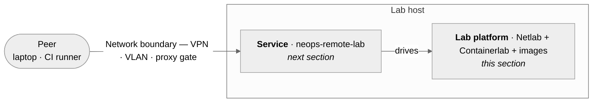

# Set up a host

*Stand up the lab platform on one Linux host: rootless Netlab + Containerlab, the device images you'll boot, and a network boundary around it. When the host is ready, **[Run the service](../30-server/index.md)** installs and starts `neops-remote-lab` on top of it.*

## What you're standing up

A Remote Lab host has **three components** — two run on the host, one wraps around it:

| | Component | Lives | Where it's set up |
|---|---|---|---|
| :material-server-network: | **Lab platform** &mdash; [Netlab](https://netlab.tools/) + [Containerlab](https://containerlab.dev/) + device images | on the host | **this section** &mdash; phases 2, 3 |
| :material-shield-lock: | **Network boundary** &mdash; VPN, VLAN, or reverse-proxy gate | around the host | **this section** &mdash; phase 4 |
| :material-rocket-launch: | **Service** &mdash; `neops-remote-lab`, the FastAPI server that drives the platform | on the host | **[Run the service](../30-server/index.md)** &mdash; next section |

Peers reach the service only through the boundary — the service ships [without HTTP authentication](../30-server/30-security.md), so the network *is* the access control.

This section configures the **lab platform** and the **network boundary** — the host prerequisites the service will run on. **Setting up a host is four phases done once per box**: pick the deployment shape, install the lab tooling, choose your device images, enclose the host in a network boundary.

## The four phases

1.  **[Decide your shape](05-pick-deployment.md)** — local laptop / single shared VM / multi-tenant lab / CI runner pool. Each shape routes to a different starting guide and a different effort budget.

2.  **[Install lab tooling](10-netlab-host-setup.md)** — rootless [Netlab](https://netlab.tools/) + [Containerlab](https://containerlab.dev/) on Ubuntu 24.04+, validated with `netlab test clab`. The hard part is the rootless wiring; the guide walks it step by step.

3.  **[Pick device images](20-vendor-setup.md)** — FRR for free, Nokia SR Linux for container-native, Cisco IOL via [vrnetlab](https://github.com/hellt/vrnetlab) when you need IOS. Or any vendor [Netlab](https://netlab.tools/platforms/) supports — the page covers the generic recipe too.

4.  **Enclose the host in a network boundary.** Two threads:

    -   **[Network access](25-network-enclosure.md)** is the family of options — self-hosted Headscale, managed mesh VPN services (Tailscale, NetBird, ZeroTier, Twingate, …), plain WireGuard, network-layer ACLs, application-layer mTLS. Read it first if you haven't already picked a path; **your own VPN solution is fine** — the lab service is unaware of which boundary surrounds it.
    -   **[Headscale quick start](30-headscale-quick-setup.md)** is the five-command happy path for the option this project ships docs for. Follow it if you want the recommended path; otherwise the [Network access](25-network-enclosure.md) page lists what's the same regardless. ([Headscale reference](40-headscale-reference.md) covers ACLs, OIDC, and troubleshooting once the tailnet is up.)

When the host is ready, install and start the service: **[Run the service →](../30-server/index.md)**.

## What this section produces

When you finish, the host has:

- [x] `netlab` and `containerlab` running rootless under your user
- [x] The vendor device images you need pulled or built locally
- [x] A network boundary (VPN tailnet, internal VLAN, or reverse-proxy gate) around the lab host
- [x] Clients (laptops, CI runners) reaching the lab subnet through that boundary
- [x] `X-Session-ID`-only access to the service — the boundary *is* the security perimeter

`neops-remote-lab` itself is **not yet installed** at this point. That happens in **[Run the service → Operator runbook](../30-server/10-administration.md)**: install via `uv` or `pipx`, run under `systemd`, recover from stale locks.
