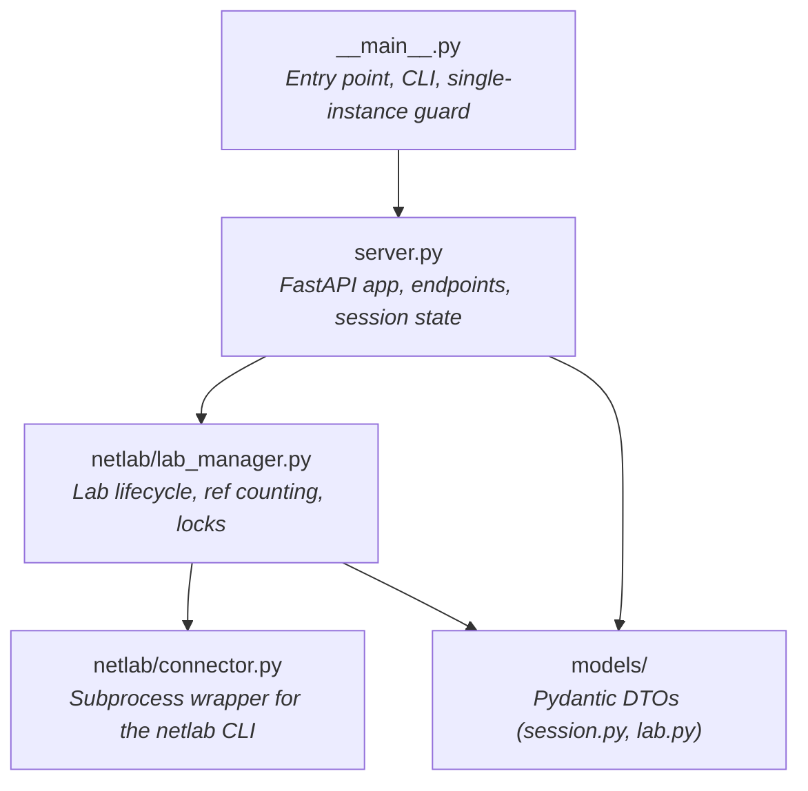

# Invariants & internals

Two parts. The first half lists the **invariants** — the rules a change
cannot break without coordinating the surface area of every consumer. The
second half walks through the **internals** that enforce those rules:
how `_run_blocking` keeps the event loop responsive, how `LabManager` is a
classmethod-only singleton with cross-process locking, how `atexit` cleans up
without an event loop, how the test suite stubs Netlab, and why every Netlab
shell-out goes through one helper.

If you are about to touch `server.py`, `lab_manager.py`, or
`netlab/connector.py`, read both halves first.

---

## Invariants

### One server instance per host

<!-- trace: neops_remote_lab/__main__.py:104 -->
The entrypoint takes a non-blocking `FileLock` at a fixed path under the
system temp directory. A second instance attempting to start on the same
host fails the lock, logs the running owner's pid/user/host/bind/cmd, and
exits with status 1.

| Why | Two servers would race on the single Netlab `default` instance and corrupt lab state mid-test. |
|---|---|
| Where it lives | `_acquire_singleton_lock()` in `__main__.py`. |
| What breaks if you remove it | Concurrent `netlab up`/`netlab down` from two processes; orphaned containers; queue corruption. |
| Cross-process safety | The `FileLock` survives a crash. Stale-lock recovery procedure is in [Administration → Stale-lock recovery](../30-server/30-administration.md#stale-lock-recovery). |

### One lab per host

<!-- trace: neops_remote_lab/netlab/lab_manager.py:43 -->
Netlab itself only manages one topology per host. `LabManager` enforces this
twice — a class-level singleton in-process, plus a system-wide `FileLock` for
cross-process serialization (e.g. against a developer running local
`netlab` by hand alongside the server).

The two layers exist for different threats: the singleton stops two async
tasks in the server from racing; the file lock stops a separate Python
process from trampling on shared state.

### Topology identity is the SHA-256 of file content

<!-- trace: neops_remote_lab/netlab/lab_manager.py:129 -->
Not the filename. Two files with different names but identical bytes are the
same topology — `reuse=True` on the second upload attaches to the running
lab. Edit one byte and it is a new topology; `reuse=True` will refuse and
either teardown-then-restart (if `ref == 0`) or return `423`.

Most systems key on filename. This one does not. Code that depends on
filename equality is wrong; code that depends on content equality is right.

### `.yml` extension is required by `LabManager`

<!-- trace: neops_remote_lab/netlab/lab_manager.py:68 -->
`prepare_workdir` rejects anything whose suffix is not exactly `.yml`
(lowercase). The HTTP layer is more permissive — `POST /lab` accepts both
`.yml` and `.yaml` at upload time — which means a `.yaml` upload passes the
HTTP check, the session is promoted to ACTIVE, and only then does
`LabManager` raise. The slot is wasted.

If you change either layer, change both. Better: tighten the HTTP layer to
match `LabManager`. Documented surface for users in
[Topology format → required `.yml`](../10-concepts/40-topology-format.md#required-the-yml-extension).

### `X-Session-ID` is the only access boundary on `/lab/*`

<!-- trace: neops_remote_lab/server.py:390 -->
There is no Bearer token, no mTLS, no tenant header. The `/lab/*` endpoints
gate on a header lookup that confirms the session exists and is `ACTIVE`.
Non-active sessions get `423 Locked`; unknown sessions get `404`.

`/session/heartbeat` is gated more loosely: it only requires the session to
exist (so a `WAITING` session can keep its queue slot alive). This
asymmetry is deliberate — see
[Session queue → access boundary](../10-concepts/20-session-queue.md#the-access-boundary).

The service is internal-trust. Treat any deployment without a VPN enclosure
as exposing a lab host to the open internet. See
[Administration → Security posture](../30-server/30-administration.md#security-posture).

### `*Dto` suffix on Pydantic request/response models {#dto-suffix}

Every request and response model in `neops_remote_lab.models.*` ends in
`Dto`: `SessionInfoDto`, `CreateSessionResponseDto`, `LabStatusDto`,
`AcquireResponseDto`, `DeviceInfoDto`. Code review will reject a PR that
introduces a model without the suffix.

Why this matters beyond consistency: the convention lets a reader scan a
file and immediately distinguish wire-format models from internal types.
Mixing them is a recipe for accidentally serializing internal state to the
HTTP surface.

### CVE-pinned dependencies {#cve-pinned-dependencies}

Several entries in `pyproject.toml` carry `# CVE-*` comments:

```toml
"starlette>=0.49.1",   # CVE-2025-62727 fix
"filelock>=3.20.1,<4", # CVE-2025-68146 fix
"pytest>=9.0.3,<10",   # CVE-2025-71176 fix
```

When upgrading, preserve the comment and pick a version that still includes
the patch. Then re-run `make audit` (`pip-audit --strict`) to confirm. If
`pip-audit` is clean, ship; if not, you've regressed a security pin.

The convention is enforced by code review and by `make audit` in CI. It is
not enforced by tooling alone — comments can be deleted accidentally — so
treat them as load-bearing.

### One `remote_lab_fixture` per test (collection-time)

<!-- trace: neops_remote_lab/testing/pytest_order_plugin.py:88 -->
A test that depends on more than one fixture created by `remote_lab_fixture`
fails at pytest **collection** with `ValueError`. The plugin walks fixture
metadata at collection time, so the failure is immediate — not after pytest
has spent five minutes running earlier tests.

Why collection-time: a runtime failure (the second `acquire` would loop in
the `423` polling path forever, because the first `acquire`'s session still
holds the host) is much harder to diagnose than a clear `ValueError` during
collection.

If you need to exercise two topologies in the same test process, use
`reuse_lab=True` on one and split into two tests. The plugin reorders by
fixture rank to keep tests against the same lab contiguous; see
[Pytest fixtures → Test execution ordering](../20-client/10-pytest-fixtures.md#test-execution-ordering).

---

## Internals

### Module dependency graph



Direction-of-import matters here:

- **`__main__.py`** owns the CLI, logging setup, single-instance file lock,
  and the pre-flight check that `netlab` is on `PATH`. It imports
  `server.app` and hands it to Uvicorn.
- **`server.py`** is the FastAPI application — endpoints, session and queue
  state, the lifespan context manager. It calls into `LabManager` for lab
  operations and uses `models/` for serialization.
- **`lab_manager.py`** is purely synchronous. State lives on the class
  (no instances). Cross-process exclusivity is the `GLOBAL_LOCK` filelock.
- **`netlab/connector.py`** is the only module that shells out to the
  `netlab` CLI. Every `netlab` invocation flows through `run_netlab()` —
  see [Single Netlab invocation path](#single-netlab-invocation-path).

### Async and blocking discipline {#async-and-blocking-discipline}

FastAPI runs on `asyncio`. `netlab up` is a blocking subprocess that takes
minutes. Block the event loop on it and every other client polling
`GET /session/{id}` stalls — no heartbeats land, sessions go stale, the
queue corrupts.

The bridge is `_run_blocking()` in `server.py`:

```python
async def _run_blocking(func: Callable[P, T], *args: P.args, **kwargs: P.kwargs) -> T:
    loop = asyncio.get_running_loop()
    return await loop.run_in_executor(None, functools.partial(func, *args, **kwargs))
```

The default `ThreadPoolExecutor` runs the call; the event loop stays free.

**When to use it:** any path that ultimately invokes `netlab` — chiefly
`LabManager.try_acquire()` and `LabManager.cleanup()`. If you add a new
heavyweight operation, route it through `_run_blocking`.

**When not to use it:** lightweight metadata reads like
`LabManager.status()` and `LabManager.has_running_lab()` stay synchronous
inside async handlers. The thread-hop overhead exceeds the operation cost,
and there's no event-loop benefit to gain.

**The reverse is also forbidden:** never add async code inside `LabManager`
or `connector.py`. Mixing async into the synchronous half of the codebase
means passing event loops across threads — fragile, and unnecessary because
the synchronous half never needs concurrency primitives. Keep the boundary
crisp: async lives in `server.py`; everything `LabManager` and below is
synchronous.

### The `LabManager` singleton

`LabManager` is a class with only class methods and class-level state — no
instances are created. The pattern is unusual but deliberate: there is at
most one running lab per host, so there is at most one set of state to
track, and a class neatly encapsulates that without the ceremony of a
singleton instance pattern.

State on the class:

```python
class LabManager:
    _current_topo: Path | None = None       # path to the running topology source
    _current_topo_hash: str | None = None   # SHA-256 of topology content
    _handle: LabManager._Handle | None = None  # workdir, devices, ref count
```

The inner `_Handle` bundles the temp working directory, the device list
from `netlab inspect`, and the reference counter. There is at most one
`_Handle` at any time — the one-lab rule is structural, not enforced by a
runtime check.

The implication for tests: subclass `LabManager` and override the methods
that touch `netlab`. The state-management logic (refcount, hash compare,
locking) is inherited as-is. See [CI test stubbing](#ci-test-stubbing) for
the pattern.

### `try_acquire` vs `acquire`

<!-- trace: neops_remote_lab/netlab/lab_manager.py:163 -->
Two methods, almost identical signatures, opposite blocking behavior.

| Method | Blocking? | Used by | What it does on busy lab |
|---|---|---|---|
| `try_acquire(topo, reuse=True)` | non-blocking | the FastAPI server | returns `None` immediately |
| `acquire(topo, reuse=True)` | polls forever | local fixtures running in-process | sleeps 2s and retries until success |

**The server MUST use `try_acquire`.** Calling `acquire` from inside an
async handler blocks the event loop for minutes, and the loop never wakes
up to process the release that would let the call succeed — instant
deadlock for every other client. `POST /lab` returns `423 Locked` on a busy
lab and expects the HTTP client to retry; that's how the contract avoids
this trap.

**Local-process tests use `acquire`** when they're the only caller and
blocking is the point — they want the lab when it's free, no async
involved.

Mixing them is one of the easier ways to wedge the test suite. If you find
yourself reading `acquire` and unsure whether it's safe in your context,
ask: am I inside an event loop? If yes, use `try_acquire` and a polling
HTTP client.

### atexit teardown {#atexit-teardown}

<!-- trace: neops_remote_lab/netlab/lab_manager.py:327 -->
At module import time `LabManager` registers `_atexit_cleanup` with
`atexit.register`. When the interpreter exits — normally, on SIGTERM, or
because pytest crashed — the hook runs and tears down any live lab.

Two non-obvious choices:

1. **`silent=True`.** The hook calls `LabManager.cleanup(silent=True)`,
   which suppresses logging for the duration of the call. By the time
   `atexit` runs, Python's logging handlers have already had their streams
   closed, and a routine `_log.info(...)` raises `ValueError: I/O operation
   on closed file`. Silent cleanup avoids the error during a path that
   cannot itself raise without orphaning containers.

2. **Synchronous, no async.** The teardown is plain subprocess calls to
   `netlab down --cleanup`. **Never add async code to this path.** Once the
   interpreter reaches `atexit` there is no running event loop; awaiting a
   coroutine or blocking on an asyncio primitive deadlocks the interpreter
   and the process has to be `kill -9`'d. The `LabManager` and `connector`
   modules are synchronous specifically so this path stays simple.

The hook also runs when a test forgot to `release()`. A test that raises
before reaching its `finally` block may never call release — the `atexit`
hook still fires when the pytest process exits, so a lab that would
otherwise be orphaned gets cleaned up. The queue head advances on the next
server tick when the session times out.

### Lifespan and signal handlers

The FastAPI app uses an async context manager (`lifespan`) for startup
and shutdown. On startup it cleans up any stale Netlab `default` instance
left over from a crashed prior process, then launches the background
cleanup loop (`_cleanup_loop_async`) that periodically sweeps stale
sessions. On shutdown it cancels the cleanup task, removes all tracked
sessions, and runs a final `LabManager.cleanup`.

Signal handlers for `SIGTERM`/`SIGINT` are registered at module import
time, not inside the lifespan, so they are effective from the moment the
process starts. The handler does the minimal thing — sets
`_SHUTDOWN_EVENT` — and lets the cleanup loop and the lifespan handle the
actual teardown. Signal handlers must be minimal to avoid deadlocks; do
not move teardown work into them.

### Stale-state recovery

<!-- trace: neops_remote_lab/netlab/lab_manager.py:125 -->
Before starting any lab, `_start` calls `_terminate_default_netlab_instance`
to forcibly run `netlab down --instance default --cleanup`. The call is
made with `expected_failure=True`, so when no default instance exists it's
a silent no-op. When one is running (a previous job crashed before its own
teardown), it gets cleaned up.

This is unconditional — every server startup probes for stale state. The
cost is one extra subprocess call per startup; the value is a service that
recovers from operator mistakes (`Ctrl+C` mid-run, `kill -9` while a lab
was up) without manual intervention.

The companion stale-lock recovery for the singleton filelock is in
[Administration → Stale-lock recovery](../30-server/30-administration.md#stale-lock-recovery).

### Single Netlab invocation path

<!-- trace: neops_remote_lab/netlab/connector.py:85 -->
There is exactly one path from this codebase to the `netlab` CLI:
`run_netlab` in `neops_remote_lab.netlab.connector`. It builds the argv as
`["netlab", *args]`, runs the subprocess, and either streams or captures
stdout depending on the `NEOPS_NETLAB_STREAM_OUTPUT` env var.

**Never shell out to `netlab` directly from anywhere else.** The single
path concentrates four concerns:

1. **Uniform logging.** All Netlab activity flows through one logger, so
   you can grep for `netlab ... failed with exit code` and find every
   failure regardless of which method invoked it.
2. **Error handling.** Non-zero exit codes raise consistently.
3. **The `expected_failure` flag.** Cleanup paths that may legitimately
   fail (no lab running, no stale instance to kill) opt into silent
   handling. Without the flag they raise.
4. **The `NEOPS_NETLAB_STREAM_OUTPUT` toggle.** One env var controls
   streaming behavior across every Netlab call; bypassing the connector
   means inconsistent debugging UX.

If you find yourself wanting to add a `subprocess.run(["netlab", ...])`
elsewhere, the answer is to add a method to `connector.py` and call that.

### CI test stubbing {#ci-test-stubbing}

CI runs on `ubuntu-latest` without `netlab` or Containerlab installed. The
test suite stays useful because `LabManager` is a class with class-level
state and only class methods — easy to subclass and override.

The pattern: create a `StubLabManager` that overrides the methods that
would call `netlab` (`_start`, `_terminate_current`,
`_terminate_default_netlab_instance`) to return synthetic device data and
no-op the cleanup paths. Then monkeypatch `server` to use the stub:

```python
class StubLabManager(LabManager):
    """LabManager that doesn't touch netlab."""

    @classmethod
    def _start(cls, topo: Path) -> list[DeviceInfoDto]:
        cls._current_topo = topo
        cls._current_topo_hash = _compute_file_sha256(topo)
        cls._handle = LabManager._Handle(
            workdir=Path(tempfile.mkdtemp()),
            devices=[DeviceInfoDto(name="stub-r1", raw={"kind": "stub"})],
        )
        return cls._handle.devices
```

The stub inherits the state-management logic — refcount, hash comparison,
filelock — and only replaces the Netlab-dependent parts. That means tests
exercise the **same** queue and lifecycle code that production runs, just
without booting containers.

Tests that need a real Netlab installation (end-to-end, container
connectivity, real `netlab inspect` output) must be gated with a marker or
skip condition so they don't fire in CI. The convention is to assume CI
unless the test is explicitly opt-in.

### The pytest plugin entry point

`pyproject.toml` declares:

```toml
[project.entry-points.pytest11]
neops-remote-lab = "neops_remote_lab.pytest_plugins"
```

`neops_remote_lab.pytest_plugins` is a stub module that lists the real
plugins:

```python
pytest_plugins: list[str] = [
    "neops_remote_lab.testing.fixture",
    "neops_remote_lab.testing.pytest_order_plugin",
]
```

pytest's `pytest_plugins` mechanism then loads both modules. The
indirection means a single entry-point name (`neops-remote-lab`) registers
the fixture factory **and** the collection-time ordering plugin without
forcing consumers to know about either module path.

If you add a new pytest-side module, append its dotted path to
`pytest_plugins` rather than declaring a new entry point — the entry point
is the public surface, and changing its name is a breaking change for
anyone who has it in a `pytest --no-cov -p no:neops-remote-lab` invocation.

---

## Anti-patterns

A short list of "don't" rules that consolidate the above. Each one has a
section above with the reasoning.

| Don't | Why | See |
|---|---|---|
| Shell out to `netlab` directly. | Bypasses logging, error handling, `expected_failure`, the stream toggle. | [Single Netlab invocation path](#single-netlab-invocation-path) |
| Do blocking I/O in an async handler without `_run_blocking`. | Stalls the event loop; every poll from every other client backs up. | [Async and blocking discipline](#async-and-blocking-discipline) |
| Add async code to the `atexit` teardown. | No event loop at exit; deadlocks the interpreter. | [atexit teardown](#atexit-teardown) |
| Drop the `*Dto` suffix on a request/response model. | Convention is load-bearing for code review and reasoning. | [`*Dto` suffix](#dto-suffix) |
| Remove a `# CVE-*` comment on a dependency upgrade. | Pin reasoning is silent metadata; deletion regresses the security gate. | [CVE-pinned dependencies](#cve-pinned-dependencies) |
| Run two `neops-remote-lab` servers on the same host. | Filelock catches it, but only after both processes log noise; the underlying constraint is real. | [One server instance per host](#one-server-instance-per-host) |
| Run `netlab` by hand while the server is running. | State divergence; the server's `default` instance and your manual one collide. | [One lab per host](#one-lab-per-host) |
| Call `acquire` (the polling variant) from inside the server's event loop. | Loop blocks; release that would unblock you cannot land. | [`try_acquire` vs `acquire`](#try_acquire-vs-acquire) |
| Add code to `LabManager` or `connector.py` that imports `asyncio`. | Crosses the sync/async boundary the other direction; no benefit, fragile teardown. | [Async and blocking discipline](#async-and-blocking-discipline) |

## Where to go next

- **[Dev setup](10-dev-setup.md)** — concrete environment and `make check`
  workflow if you haven't run it yet.
- **[Architecture](../10-concepts/10-architecture.md)** — the user-facing
  high-level component picture; useful as a refresher or a starting point
  for someone arriving from outside the contributor flow.
- **[Session queue](../10-concepts/20-session-queue.md)** and
  **[Lab lifecycle](../10-concepts/30-lab-lifecycle.md)** — the consumer
  view of the state machines whose internals are documented above.
- **[`AGENTS.md`](https://github.com/zebbra/neops-remote-lab/blob/develop/AGENTS.md)**
  — the same invariants in repo-root form, plus the rest of the agent
  bootstrap context.
