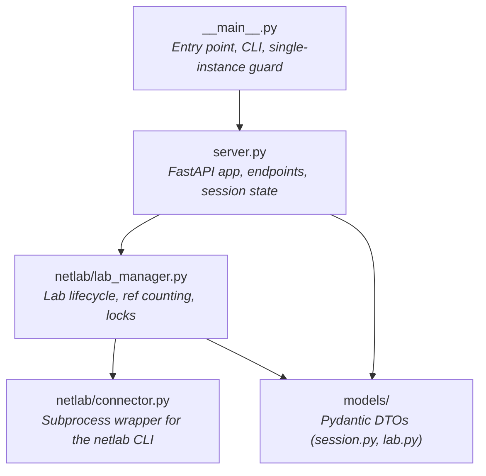

# Internals: Async discipline {#async-and-blocking-discipline}

*FastAPI runs on `asyncio`, but Netlab is blocking. The `_run_blocking` discipline is what keeps the queue responsive.*

FastAPI runs on `asyncio`. `netlab up` is a blocking subprocess that takes minutes. Block the event loop on it and every other client polling `GET /session/{id}` stalls — no heartbeats land, sessions go stale, the queue corrupts.

The bridge is `_run_blocking()` in `server.py`:

```python
async def _run_blocking(func: Callable[P, T], *args: P.args, **kwargs: P.kwargs) -> T:
    loop = asyncio.get_running_loop()
    return await loop.run_in_executor(None, functools.partial(func, *args, **kwargs))
```

The default `ThreadPoolExecutor` runs the call; the event loop stays free.

## When to use it

Any path that ultimately invokes `netlab` — chiefly `LabManager.try_acquire()` and `LabManager.cleanup()`. If you add a new heavyweight operation, route it through `_run_blocking`.

## When not to use it

Lightweight metadata reads like `LabManager.status()` and `LabManager.has_running_lab()` stay synchronous inside async handlers. The thread-hop overhead exceeds the operation cost, and there's no event-loop benefit to gain.

## The reverse is also forbidden

**Never add async code inside `LabManager` or `connector.py`.** Mixing async into the synchronous half of the codebase means passing event loops across threads — fragile, and unnecessary because the synchronous half never needs concurrency primitives.

Keep the boundary crisp: async lives in `server.py`; everything `LabManager` and below is synchronous.

The boundary survives `atexit` for the same reason — see [Internals: atexit + lifespan](50-internals-atexit.md).

## Module dependency graph



Direction-of-import matters here:

- **`__main__.py`** owns the CLI, logging setup, single-instance file lock, and the pre-flight check that `netlab` is on `PATH`. It imports `server.app` and hands it to Uvicorn.
- **`server.py`** is the FastAPI application — endpoints, session and queue state, the lifespan context manager. It calls into `LabManager` for lab operations and uses `models/` for serialization.
- **`lab_manager.py`** is purely synchronous. State lives on the class (no instances). Cross-process exclusivity is the `GLOBAL_LOCK` filelock.
- **`netlab/connector.py`** is the only module that shells out to the `netlab` CLI. Every `netlab` invocation flows through `run_netlab()` — see [Single Netlab invocation path](#single-netlab-invocation-path).

## Single Netlab invocation path {#single-netlab-invocation-path}

<!-- trace: neops_remote_lab/netlab/connector.py:85 -->
There is exactly one path from this codebase to the `netlab` CLI: `run_netlab` in `neops_remote_lab.netlab.connector`. It builds the argv as `["netlab", *args]`, runs the subprocess, and either streams or captures stdout depending on the `NEOPS_NETLAB_STREAM_OUTPUT` env var.

**Never shell out to `netlab` directly from anywhere else.** The single path concentrates four concerns:

1. **Uniform logging.** All Netlab activity flows through one logger, so you can grep for `netlab ... failed with exit code` and find every failure regardless of which method invoked it.
2. **Error handling.** Non-zero exit codes raise consistently.
3. **The `expected_failure` flag.** Cleanup paths that may legitimately fail (no lab running, no stale instance to kill) opt into silent handling. Without the flag they raise.
4. **The `NEOPS_NETLAB_STREAM_OUTPUT` toggle.** One env var controls streaming behavior across every Netlab call; bypassing the connector means inconsistent debugging UX.

If you find yourself wanting to add a `subprocess.run(["netlab", ...])` elsewhere, the answer is to add a method to `connector.py` and call that.

## See also

- **[Invariants](20-invariants.md)** — the rules these mechanics enforce.
- **[Internals: LabManager singleton & locking](40-internals-lab-manager.md)** — what runs on the synchronous side of the boundary.
- **[Internals: atexit + lifespan](50-internals-atexit.md)** — why the no-async rule extends past process exit.
- **[Anti-patterns](70-anti-patterns.md)** — the "don't" table that names each violation.
