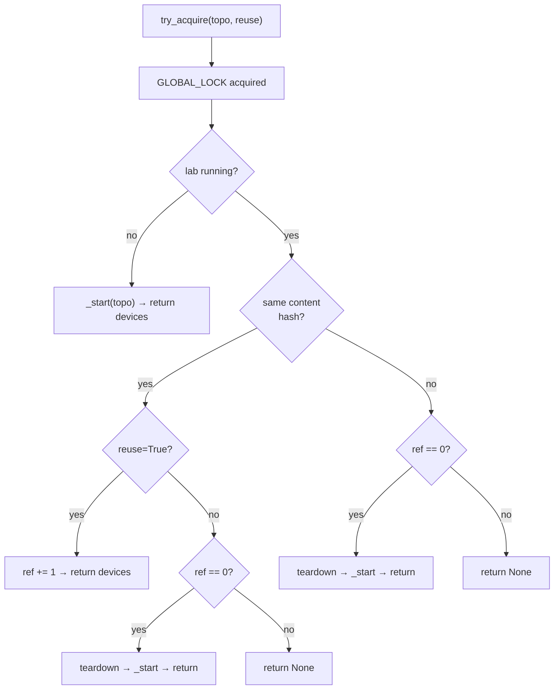

# Internals: LabManager singleton + locking

*The synchronous half of the codebase. Owns the running lab, enforces one-lab-per-host, reference-counts reuse.*

`LabManager` is the synchronous half of the codebase. It owns the running lab, enforces one-lab-per-host, and reference-counts reuse. Everything below the FastAPI layer goes through it.

## The singleton pattern

`LabManager` is a class with only class methods and class-level state — no instances are created. Unusual but deliberate: there is at most one running lab per host, so there is at most one set of state to track, and a class encapsulates that without singleton-instance ceremony.

State on the class:

```python
class LabManager:
    _current_topo: Path | None = None       # path to the running topology source
    _current_topo_hash: str | None = None   # SHA-256 of topology content
    _handle: LabManager._Handle | None = None  # workdir, devices, ref count
```

The inner `_Handle` bundles the temp working directory, the device list from `netlab inspect`, and the reference counter. There is at most one `_Handle` at any time — the one-lab rule is structural, not enforced by a runtime check.

The implication for tests: subclass `LabManager` and override the methods that touch `netlab`. The state-management logic (refcount, hash compare, locking) is inherited as-is. See [Internals: CI test stubbing](60-internals-test-stubbing.md) for the pattern.

## `try_acquire` vs `acquire` {#try_acquire-vs-acquire}

<!-- trace: neops_remote_lab/netlab/lab_manager.py:163 -->
Two methods, almost identical signatures, opposite blocking behavior.

| Method | Blocking? | Used by | What it does on busy lab |
|---|---|---|---|
| `try_acquire(topo, reuse=True)` | non-blocking | the FastAPI server | returns `None` immediately |
| `acquire(topo, reuse=True)` | polls forever | local fixtures running in-process | sleeps 2s and retries until success |

**The server MUST use `try_acquire`.** Calling `acquire` from inside an async handler blocks the event loop for minutes, and the loop never wakes up to process the release that would let the call succeed — instant deadlock for every other client. `POST /lab` returns `423 Locked` on a busy lab and expects the HTTP client to retry; that's how the contract avoids this trap.

**Local-process tests use `acquire`** when they're the only caller and blocking is the point — they want the lab when it's free, no async involved.

Mixing them is one of the easier ways to wedge the test suite. If you find yourself reading `acquire` and unsure whether it's safe in your context, ask: am I inside an event loop? If yes, use `try_acquire` and a polling HTTP client.

## The decision tree



*Same `try_acquire` decision tree, viewed from the LabManager internals.*

## Cross-process serialization: `GLOBAL_LOCK`

The in-process singleton is one half of the one-lab guard. The other is `GLOBAL_LOCK`, a `filelock.FileLock` at `<tempdir>/netlab_pytest.lock`. Every lab operation takes this lock before touching state.

The two layers exist for different threats:

- The **singleton** stops two async tasks in the server from racing.
- The **file lock** stops a separate Python process — most often a developer running local `netlab` by hand alongside the server, or a `LabManager.acquire()` call from a local test fixture — from trampling shared state.

If a process holding `GLOBAL_LOCK` crashes, the OS releases the lock when the file handle goes away. The server's startup path is built around the assumption that previous holders may have left state behind.

## Stale-state recovery

<!-- trace: neops_remote_lab/netlab/lab_manager.py:125 -->
Before starting any lab, `_start` calls `_terminate_default_netlab_instance` to forcibly run `netlab down --instance default --cleanup`. The call is made with `expected_failure=True`, so when no default instance exists it's a silent no-op. When one is running (a previous job crashed before its own teardown), it gets cleaned up.

This is unconditional — every server startup probes for stale state. The cost is one extra subprocess call per startup; the value is a service that recovers from operator mistakes (`Ctrl+C` mid-run, `kill -9` while a lab was up) without manual intervention.

The companion stale-lock recovery for the singleton filelock — the *server-instance* lock, not the lab lock above — is in [Administration → Stale-lock recovery](../30-server/10-administration.md#stale-lock-recovery).

## See also

- **[Invariants → One lab per host](20-invariants.md#one-lab-per-host)** — the rule this code enforces.
- **[Internals: Async discipline](30-internals-async.md)** — why the server crosses the async/sync boundary through `_run_blocking` to call into `LabManager`.
- **[Internals: atexit + lifespan](50-internals-atexit.md)** — the teardown path that runs when an interpreter exits with state still on the class.
- **[Internals: CI test stubbing](60-internals-test-stubbing.md)** — how the singleton design makes a `StubLabManager` trivial.
