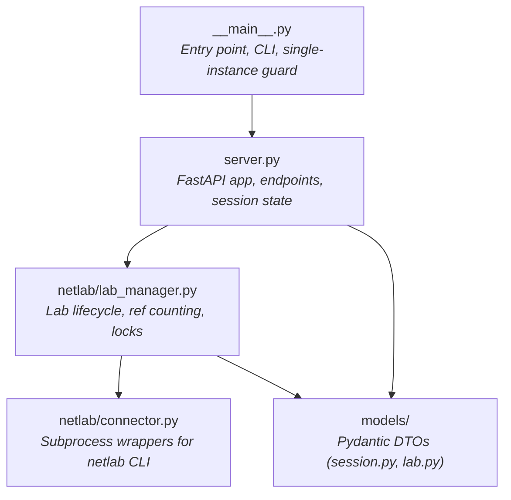

# Internal Architecture

Why the server holds one lab and only one lab, and what that costs you when the test suite grows -- the module layout on this page follows directly from that constraint. The class-level state, the dual `FileLock`, the `_run_blocking()` async/sync boundary, and the `atexit` teardown all exist so one callable host can be shared safely by several clients. For the high-level component overview (server, client, request flow, trust model), see [Concepts > Architecture](../10-concepts/10-architecture.md), which links back here from its [Components](../10-concepts/10-architecture.md#components) discussion.

## Module dependency graph

The server-side code has a clear dependency hierarchy:



Key relationships:

- **`__main__.py`** imports `server.app` and passes it to Uvicorn. It owns the CLI argument parsing, logging setup, single-instance file lock, and pre-flight checks (is `netlab` in PATH?).
- **`server.py`** defines the FastAPI application, all HTTP endpoints, session/queue state, and the async lifespan. It calls into `LabManager` for lab operations and uses models for request/response serialization.
- **`lab_manager.py`** is a pure-synchronous class with class-level state (no instances). It manages lab lifecycle through the `netlab` CLI via `connector.py` and enforces the one-lab-per-host rule with a cross-process `FileLock`.
- **`connector.py`** is the only module that shells out to `netlab`. All subprocess invocations go through `run_netlab()`, which handles streaming vs. captured output, timing, error handling, and expected-failure semantics.

## The async/sync boundary

The FastAPI server runs on an asyncio event loop, but Netlab operations are blocking subprocess calls. The bridge between these two worlds is `_run_blocking()` in `server.py`:

```python
async def _run_blocking(func: Callable[P, T], *args: P.args, **kwargs: P.kwargs) -> T:
    loop = asyncio.get_running_loop()
    return await loop.run_in_executor(None, functools.partial(func, *args, **kwargs))
```

This dispatches blocking calls to the default `ThreadPoolExecutor` so the event loop stays responsive for heartbeats, health checks, and session management while a `netlab up` runs in the background.

**When to use it**: Only for heavyweight operations that ultimately call `netlab` -- `LabManager.try_acquire()`, `LabManager.cleanup()`, and similar. Lightweight metadata lookups like `LabManager.status()` and `LabManager.has_running_lab()` run synchronously in the async handler because the overhead of thread-hopping outweighs the negligible blocking time.

**When not to use it**: Never add async code to any path that runs inside `_run_blocking`. The `LabManager` and `connector` modules are intentionally synchronous. Mixing async into them would require passing event loops across threads, which is fragile and unnecessary.

## State management

The server manages two categories of state, both held in module-level data structures in `server.py`.

### Session and queue state

```python
_SESSION_QUEUE: list[str] = []        # FIFO order of session IDs
_SESSIONS: dict[str, SessionInfoDto] = {}  # session ID → session metadata
```

- `_SESSION_QUEUE` is a plain list that maintains FIFO insertion order. The first element is always the `ACTIVE` session (enforced by `_promote_if_needed()`).
- `_SESSIONS` is the authoritative lookup. Orphaned queue entries (IDs in the queue but missing from the dict) are silently dropped during promotion.
- There is no database. State is entirely in-process and rebuilt from scratch on restart.

### Lab state

Lab state lives as class attributes on `LabManager`:

```python
class LabManager:
    _current_topo: Path | None = None       # path to the running topology source
    _current_topo_hash: str | None = None   # SHA-256 fingerprint of topology content
    _handle: LabManager._Handle | None = None  # workdir, devices, ref count
```

The `_Handle` inner class bundles the temporary working directory, the device list from `netlab inspect`, and the reference counter. There is at most one `_Handle` at any time -- the one-lab rule is structural.

Cross-process exclusivity is enforced by `GLOBAL_LOCK`, a `FileLock` in the system temp directory. `try_acquire()`, `release()`, `_terminate_current()`, and `cleanup()` all acquire this lock before mutating state.

## Lifespan pattern

The FastAPI app uses an async context manager (`lifespan`) for startup and shutdown logic:

```python
@asynccontextmanager
async def lifespan(_app: FastAPI) -> AsyncGenerator[None, None]:
    # Startup: clean stale netlab instances, start cleanup background task
    await _run_blocking(LabManager.cleanup, default_instance=True, reason="server-startup")
    cleanup_task = asyncio.create_task(_cleanup_loop_async())

    yield  # Server is running

    # Shutdown: cancel cleanup task, delete sessions, final lab teardown
    _SHUTDOWN_EVENT.set()
    cleanup_task.cancel()
    for session_id in list(_SESSIONS.keys()):
        _delete_session(session_id, reason="server-shutdown")
    await _run_blocking(LabManager.cleanup, reason="server-shutdown")
```

The startup phase cleans up any `default` Netlab instance from a previous crashed run, then launches a background task (`_cleanup_loop_async`) that periodically sweeps stale sessions. The cleanup loop uses adaptive sleep intervals -- longer when idle, shorter when sessions are active.

The shutdown phase is triggered by SIGTERM/SIGINT. It cancels the cleanup task, removes all tracked sessions, and runs a final `LabManager.cleanup`.

## Signal handlers

Signal handlers are registered at module import time (not inside the lifespan), so they are effective immediately:

```python
def signal_handler(signum: int, _frame: FrameType | None) -> None:
    _log.warning("Received signal %d, shutting down gracefully...", signum)
    _SHUTDOWN_EVENT.set()

signal.signal(signal.SIGTERM, signal_handler)
signal.signal(signal.SIGINT, signal_handler)
```

The handler sets `_SHUTDOWN_EVENT`, which the cleanup loop and other code paths check to short-circuit during shutdown. The actual teardown work happens in the lifespan's shutdown block, not in the signal handler itself -- signal handlers must be minimal to avoid deadlocks.

## atexit hooks

`LabManager` registers a last-resort cleanup via `atexit`:

```python
def _atexit_cleanup() -> None:
    LabManager.cleanup(silent=True, reason="atexit")

atexit.register(_atexit_cleanup)
```

The `silent=True` flag disables logging during cleanup because Python's logging infrastructure may already be partially torn down at interpreter exit. Writing to a closed stream handler would raise exceptions, so the cleanup runs with logging suppressed.

**Do not add async code to the atexit path.** The event loop is gone by the time `atexit` runs. Any async call will deadlock or raise `RuntimeError`.

## Test stubbing pattern

CI does not install the Netlab CLI, so server tests use a stubbed `LabManager`. The pattern is to subclass `LabManager` and override the methods that would call `netlab`:

```python
class StubLabManager(LabManager):
    """LabManager that doesn't touch netlab."""

    @classmethod
    def _start(cls, topo: Path) -> list[DeviceInfoDto]:
        # Return fake devices without calling netlab
        cls._current_topo = topo
        cls._current_topo_hash = _compute_file_sha256(topo)
        cls._handle = LabManager._Handle(
            workdir=Path(tempfile.mkdtemp()),
            devices=[DeviceInfoDto(name="stub-r1", raw={"kind": "stub"})],
        )
        return cls._handle.devices
```

Tests then monkeypatch the server module to use the stub. This approach works because `LabManager` is a class with only class methods and class-level state -- there are no instances to mock. The stub inherits all the state management logic (ref counting, hash comparison, locking) and only replaces the Netlab-dependent parts.

Any test that needs a real Netlab installation must be gated with a marker or skip condition, since CI runners do not have `netlab` available.
