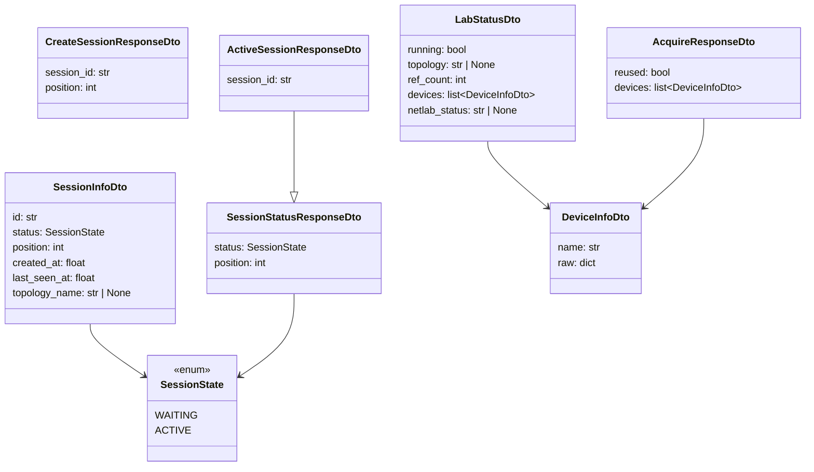

# Data Models

All request and response bodies in the Remote Lab API are defined as Pydantic v2 models, suffixed with `*Dto`. These models live in two files under `neops_remote_lab/models/`: one for session-related types and one for lab-related types.

For the API endpoints that use these models, see the [REST API](../20-server/10-rest-api.md) reference. For how sessions and labs interact at runtime, see [Session Queue](../10-concepts/20-session-queue.md) and [Lab Lifecycle](../10-concepts/30-lab-lifecycle.md).

## SessionState enum

**Module**: `neops_remote_lab.models.session`

The `SessionState` enum defines the two possible states for a session in the queue.

| Value | Description |
|-------|-------------|
| `"waiting"` | Session is queued but not yet at the front. Lab endpoints return `423 Locked`. |
| `"active"` | Session is at the front of the queue and can use `/lab/*` endpoints. |

`SessionState` extends both `str` and `Enum`, so it serializes to its string value in JSON responses.

Sessions transition from `WAITING` to `ACTIVE` when they reach the front of the FIFO queue (handled by `_promote_if_needed()` in `server.py`). There is no reverse transition -- once active, a session stays active until it is deleted or times out.

## Session models

**Module**: `neops_remote_lab.models.session`

### SessionInfoDto

Internal session record used by the server to track session state. Not directly exposed on the API surface, but it is the authoritative representation in the `_SESSIONS` dict.

| Field | Type | Description |
|-------|------|-------------|
| `id` | `str` | UUID v4 session identifier, generated server-side. |
| `status` | `SessionState` | Current session state (`WAITING` or `ACTIVE`). |
| `position` | `int` | Zero-based position in the FIFO queue. `0` means active. |
| `created_at` | `float` | Unix timestamp when the session was created. |
| `last_seen_at` | `float` | Unix timestamp of last heartbeat or API interaction. Used by the cleanup loop to detect stale sessions. |
| `topology_name` | `str | None` | Filename of the topology uploaded via `POST /lab`. Set after lab acquisition; `None` until then. Default: `None`. |

### CreateSessionResponseDto

Response body for `POST /session`.

| Field | Type | Description |
|-------|------|-------------|
| `session_id` | `str` | The newly created session's UUID. |
| `position` | `int` | Initial queue position. |

### SessionStatusResponseDto

Response body for `GET /session/{session_id}`.

| Field | Type | Description |
|-------|------|-------------|
| `status` | `SessionState` | Current session state. |
| `position` | `int` | Current queue position. |

### ActiveSessionResponseDto

Response body for `GET /active-session`. Extends `SessionStatusResponseDto`.

| Field | Type | Description |
|-------|------|-------------|
| `session_id` | `str` | The active session's UUID. |
| `status` | `SessionState` | Always `ACTIVE` for this endpoint. *(inherited)* |
| `position` | `int` | Always `0` for this endpoint. *(inherited)* |

## Lab models

**Module**: `neops_remote_lab.models.lab`

### DeviceInfoDto

Represents a single Netlab node. Returned as part of lab acquisition and device listing responses.

| Field | Type | Description |
|-------|------|-------------|
| `name` | `str` | Node name as reported by `netlab inspect`. Example: `"r1"`, `"r2"`. |
| `raw` | `dict[str, Any]` | Complete raw dictionary from `netlab inspect --format yaml` for this node. Contains provider-specific details (management IP, container ID, interfaces, etc.). |

`DeviceInfoDto` is configured with `model_config = ConfigDict(from_attributes=True)`, allowing construction from ORM-style objects (though this is not currently used).

### LabStatusDto

Server-side lab status. Response body for `GET /lab`.

| Field | Type | Default | Description |
|-------|------|---------|-------------|
| `running` | `bool` | *(required)* | Whether a lab is currently running. |
| `topology` | `str | None` | `None` | File path of the running topology, or `None` if no lab is active. |
| `ref_count` | `int` | `0` | How many clients currently hold a reference to the lab. `0` means idle but still running. |
| `devices` | `list[DeviceInfoDto]` | `[]` | Device list. Only populated when `include_devices=True` is passed to `LabManager.status()`. |
| `netlab_status` | `str | None` | `None` | Raw output of `netlab status`, if available. Currently always `None` (reserved for future use). |

### AcquireResponseDto

Response body for `POST /lab` (lab acquisition).

| Field | Type | Description |
|-------|------|-------------|
| `reused` | `bool` | `True` if the lab was already running with the same topology and the reference count was incremented. `False` if a fresh lab was started. |
| `devices` | `list[DeviceInfoDto]` | List of devices in the lab, as returned by `netlab inspect`. |

## Model relationships

## Conventions

- **`*Dto` suffix**: All API-facing models use this suffix, per the project conventions in `AGENTS.md`.
- **No custom exceptions**: Errors are raised as `HTTPException(status_code, detail=...)` directly in endpoint handlers. There is no custom exception hierarchy.
- **Pydantic v2**: All models use Pydantic v2 syntax (`BaseModel`, `Field`, `ConfigDict`). The `# type: ignore[misc]` comments suppress a known pyrefly false positive on BaseModel subclasses.
