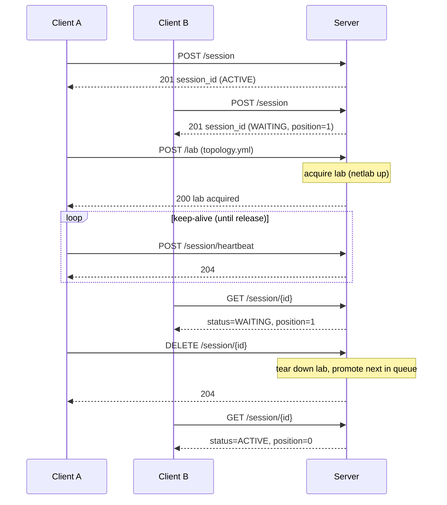

# Neops Remote Lab

Run network labs on a shared server, test from anywhere. Neops Remote Lab manages Netlab topologies on a remote host while your pytest suite stays local -- a lightweight server schedules exclusive sessions through a queue, letting CI jobs and developers safely share the same lab infrastructure.

!!! tip "New to Remote Lab?"
    Start with [Getting Started](getting-started/index.md) -- you'll have a running lab in 15 minutes.

## How It Works

A session queue serializes access. The first client gets an `ACTIVE` session immediately; subsequent clients wait in line. Once active, a client uploads a topology file and the server orchestrates Netlab to bring the lab up. Heartbeats keep the session alive; when the client finishes, the lab tears down and the next session promotes.

## Key Features

- **One-lab-per-host exclusivity** -- only one Netlab topology runs at a time, enforced by a FIFO session queue and automatic reference counting.
- **Zero-config client** -- set `REMOTE_LAB_URL` and your existing pytest fixtures transparently switch to remote mode.
- **Lab reuse** -- tests sharing the same topology can reuse a running lab instead of tearing down and rebuilding, identified by SHA-256 content hash.
- **Automatic cleanup** -- stale sessions are detected via heartbeat timeouts and cleaned up by an adaptive background task.
- **Python client and pytest plugin** -- `RemoteLabClient` for programmatic access; `remote_lab_fixture` for declarative test fixtures.

## Where This Fits

Remote Lab is consumed primarily by **neops-worker-sdk-py** (the Python SDK for writing neops workers), which imports `remote_lab_fixture` to run integration tests against real Netlab topologies. The server runs on a VM with Netlab and Containerlab installed; the client runs wherever your tests run -- a developer laptop, CI runner, or any machine with network access to the server. A [Headscale/Tailscale VPN](50-deployment/20-headscale-vpn.md) typically routes traffic between the test runner and lab subnets.

## Explore the Docs

| Section | What you'll find | Time |
|---------|-----------------|------|
| [Getting Started](getting-started/index.md) | Install, configure, run your first remote lab session | ~15 min |
| [Concepts](10-concepts/index.md) | Architecture, session queue mechanics, lab lifecycle | ~20 min |
| [Server](20-server/index.md) | REST API reference, configuration, administration | ~15 min |
| [Client](30-client/index.md) | `RemoteLabClient` API, pytest fixture factory | ~10 min |
| [Testing](40-testing/index.md) | Local vs. remote testing patterns, debugging | ~15 min |
| [Deployment](50-deployment/index.md) | Netlab setup, Headscale VPN, production deployment | ~20 min |
| [Development](60-development/index.md) | Internal architecture, data models, contributing | ~15 min |
