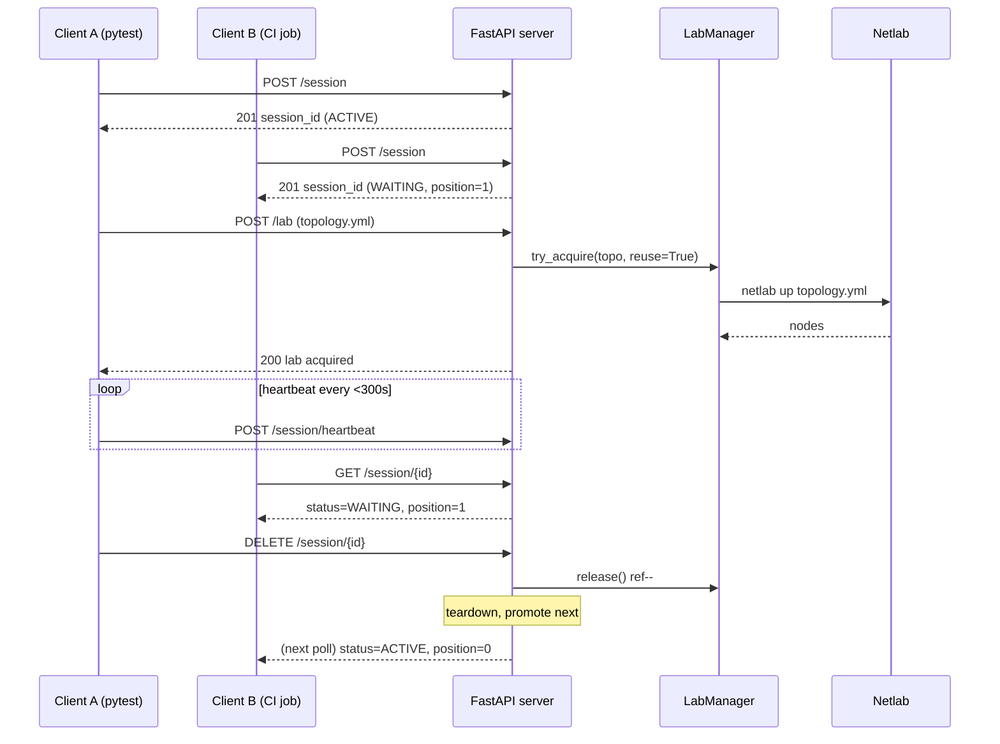

# Neops Remote Lab

*A FastAPI service exposing exclusive, queue-brokered access to a real [Netlab](https://netlab.tools/) topology — drive it from a pytest11 plugin (Python), the bundled REST API (any stack), or both.*

`neops-remote-lab` fronts a Netlab host with a small HTTP service and a pytest fixture. Every test asks for a session, waits in a FIFO queue, gets the lab, then tears it down when the last consumer walks away.

<!-- trace: neops_remote_lab/server.py:390 -->
<!-- trace: neops_remote_lab/netlab/lab_manager.py:43 -->

## Pick your path

-   :material-test-tube:{ .lg .middle } &nbsp; **Worker SDK developers**

    ---

    *A real Netlab device for your function-block tests.*

    - Install + `REMOTE_LAB_URL` — two steps, then the [Worker SDK testing guide](https://docs.neops.io/neops-worker-sdk-py/docs/testing/30-remote-lab/) takes over
    - Multi-vendor topology patterns (FRR, Nokia SR Linux, Cisco IOL)
    - The pytest fixture the Worker SDK imports as a stable API

    [Plug into Worker SDK :material-arrow-right:](getting-started/15-worker-sdk.md)

-   :material-server:{ .lg .middle } &nbsp; **Operators**

    ---

    *Run the service on a shared host.*

    - 30-second foreground launch + `/healthz` sanity check
    - Pick the deployment shape — laptop, VM, multi-tenant, or CI runner pool
    - `systemd` unit, stale-lock recovery, stuck-lab cleanup runbook

    [Run the service :material-arrow-right:](30-server/index.md)

-   :material-source-branch:{ .lg .middle } &nbsp; **Contributors**

    ---

    *Change the codebase safely.*

    - The 30-minute path to your first PR
    - Eight invariants every change must preserve
    - Internals deep-dives (async, locking, atexit, test stubbing) and an anti-patterns grep target for review

    [Contribute :material-arrow-right:](50-contributing/index.md)

-   :material-api:{ .lg .middle } &nbsp; **External API users**

    ---

    *Drive the lab from any HTTP-capable stack.*

    - Six cURL calls end-to-end — no Python required
    - Full REST contract with per-endpoint examples
    - Wire into GitHub Actions, GitLab CI, or Jenkins

    [Drive from cURL :material-arrow-right:](getting-started/30-curl.md)

## Session-and-lab lifecycle

Every test follows the same four-step lifecycle: **create a session** (which joins the queue), **wait to become active**, **upload a topology and acquire the lab**, then **release** on teardown. Client B waits behind Client A without ever touching a lock.

<!-- trace: neops_remote_lab/server.py:390 -->

*FIFO queue → exclusive access → shared teardown when the last user leaves.* The promotion rules, stale-session timeouts, and heartbeat cadence live in [Session Queue](10-concepts/20-session-queue.md); SHA-256-keyed reuse counting in [Lab Lifecycle](10-concepts/30-lab-lifecycle.md).

## Where it sits in the neops ecosystem

`neops-remote-lab` is the test substrate for the wider neops platform. The [Worker SDK](https://docs.neops.io/neops-worker-sdk-py/docs/) imports `remote_lab_fixture` directly. If you're new to neops, [How Remote Lab fits with neops](99-appendix/neops-ecosystem.md) maps the surrounding pieces; if you're not on neops at all, this section is safely skippable.

<!-- trace: AGENTS.md:3 -->

!!! danger "No HTTP authentication"
    `neops-remote-lab` ships **without** bearer-token, OAuth, or mTLS
    authentication. The only access boundary on `/lab/*` is the
    `X-Session-ID` of an ACTIVE session. **Deploy behind a VPN.** See
    [Security model](30-server/30-security.md) for the full posture.
    <!-- trace: neops_remote_lab/server.py:488 -->

## Reading paths

Pick the route that matches your current question.

!!! tip "New to the project — you want your first passing test"
    [Quickstart](getting-started/10-pytest.md) → [Pytest Fixtures](20-client/10-pytest-fixtures.md) → [Topology Format](10-concepts/40-topology-format.md). Install, three-line test, see it pass.

!!! info "Concepts first — you want to understand before you build"
    [Architecture](10-concepts/10-architecture.md) → [Session Queue](10-concepts/20-session-queue.md) → [Lab Lifecycle](10-concepts/30-lab-lifecycle.md) → [Topology Format](10-concepts/40-topology-format.md). Every invariant the system enforces and why.

!!! info "Standing up the host — you are deploying the service"
    [Netlab host setup](40-deployment/10-netlab-host-setup.md) → [Headscale quick start](40-deployment/30-headscale-quick-setup.md) → [Operator runbook](30-server/10-administration.md) → [Configuration](30-server/20-configuration.md). Install Netlab, enclose the host in a private tailnet, configure and operate the server.

!!! info "Wiring in a new client — you are integrating a consumer"
    [REST API](30-server/40-rest-api.md) → [Python Client](20-client/20-python-client.md) → [Pytest Fixtures](20-client/10-pytest-fixtures.md). The API reference is authoritative; the Python client is a thin wrapper; the fixture is the stable consumer surface.

!!! info "Driving from a non-Python stack — you are integrating into an existing harness"
    [REST quickstart](getting-started/30-curl.md) → [CI quickstart](getting-started/40-ci.md) → [Debugging](30-server/50-debugging.md). Stand up a session and a lab end-to-end with cURL, then wire it into your CI runner of choice.

!!! info "Looking for runnable examples"
    [Cookbook](99-appendix/cookbook.md). Pytest, Python (no-pytest), cURL, topology, and deployment recipes — every link goes to GitHub so the recipe survives docs-site rebuilds.

## External references

- [neops platform docs](https://docs.neops.io/) — the umbrella site for the wider platform.
- [Netlab](https://netlab.tools/) — the upstream lab orchestrator this service wraps. Authoritative reference for topology YAML, providers, and vendor kinds.
- [Worker SDK](https://docs.neops.io/neops-worker-sdk-py/docs/) — the primary consumer; imports `remote_lab_fixture` as a stable API ([integration guide](https://docs.neops.io/neops-worker-sdk-py/docs/testing/30-remote-lab/)).
- [Containerlab](https://containerlab.dev/) — the container runtime Netlab drives by default in this project (`provider: clab`).
- [Headscale](https://headscale.net/) — the open-source Tailscale control plane used for the recommended VPN enclosure ([deployment guide](40-deployment/30-headscale-quick-setup.md)).
- [Material for MkDocs reference](https://squidfunk.github.io/mkdocs-material/reference/) and [pymdown-extensions Snippets](https://facelessuser.github.io/pymdown-extensions/extensions/snippets/) — theme and extension docs backing this site.
- Project [`README.md`](https://github.com/zebbra/remote-lab/blob/develop/README.md) and [`AGENTS.md`](https://github.com/zebbra/remote-lab/blob/develop/AGENTS.md) — repository-level conventions, invariants, and agent context.
