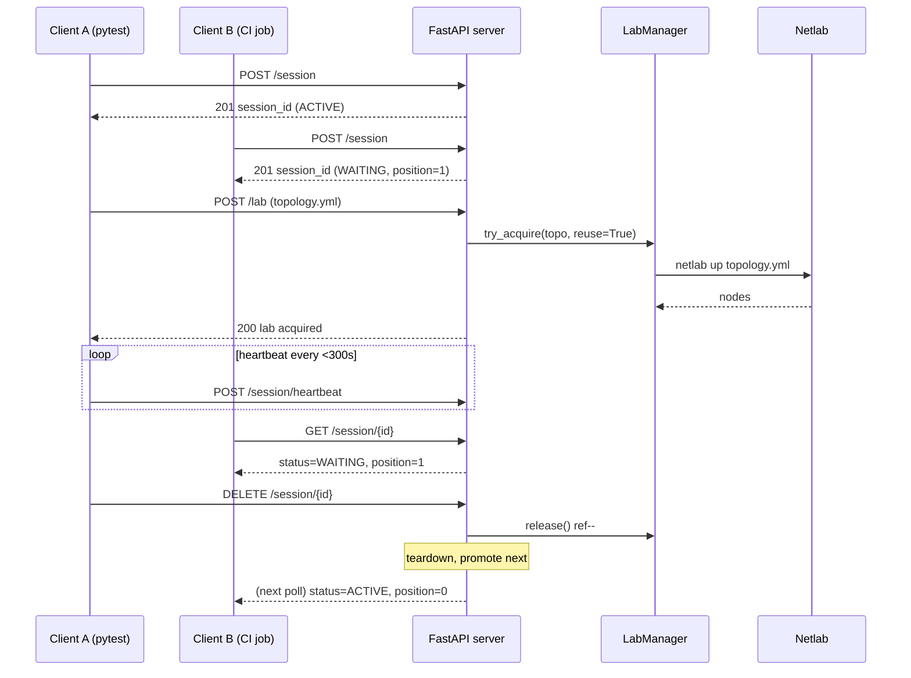

# Neops Remote Lab

*A FastAPI service and pytest11 plugin that gives your tests exclusive, reference-counted access to a real Netlab topology — without stepping on anyone else's.*

Network-automation tests want real routers, not mocks. But Netlab only lets
one topology run per host, so a shared lab host turns into a collision
playground the moment more than one engineer — or more than one CI job —
presses *run*. `neops-remote-lab` fronts that host with a small HTTP service
and a pytest fixture: every test asks for a session, waits its turn in a FIFO
queue, gets the lab, then tears it down when the last consumer walks away.

<!-- trace: neops_remote_lab/server.py:390 -->
<!-- trace: neops_remote_lab/netlab/lab_manager.py:43 -->

## Where it sits in the neops ecosystem

This repository ships two cooperating surfaces: a **FastAPI server**
(`neops_remote_lab.server`) that runs on the lab host, and a **pytest11
plugin** (`neops_remote_lab.testing.fixture`) that runs inside your test
suite. The plugin's `remote_lab_fixture` factory is the stable public API —
**neops-worker-sdk-py imports it directly** — so any change to that call
signature is a downstream break.

<!-- trace: AGENTS.md:3 -->

!!! note "Two audiences, one project"
    If you are writing tests, you will only touch the pytest side
    (`remote_lab_fixture`, `RemoteLabClient`). If you are running the
    service on a shared host, you will mostly live in the FastAPI side and
    the Netlab + VPN deployment pages. The two surfaces share terminology
    ("session", "lab", "reuse") but not a threading model — the server is
    async, the client is blocking.

!!! danger "Internal-trust service — no HTTP authentication"
    `REMOTE_LAB_TOKEN` / Bearer auth is commented out in `client.py`. The
    only access boundary on `/lab/*` endpoints is the `X-Session-ID` header
    of an ACTIVE session; non-active sessions receive `423 Locked`. The
    `/session/heartbeat` endpoint is gated less tightly — it only requires
    the session to exist (404 if unknown) and accepts heartbeats from
    WAITING sessions too, which is how a client keeps its queue slot alive
    before promotion. **Deploy only on a Headscale tailnet or another
    private network.** See
    [Administration → Security posture](administration.md#security-posture)
    for the full threat model and
    [Headscale VPN](headscale_headplane.md) for the recommended enclosure.
    <!-- trace: neops_remote_lab/client.py:46 -->
    <!-- trace: neops_remote_lab/server.py:488 -->

## Session-and-lab lifecycle

Every test follows the same four-beat dance: **create a session** (which
joins the queue), **wait to become active**, **upload a topology and
acquire the lab**, then **release** on teardown. Client B waits behind
Client A without ever touching a lock.

<!-- trace: neops_remote_lab/server.py:390 -->

*Session-and-lab lifecycle: FIFO queue → exclusive access → refcount
teardown.* The promotion rules, stale-session timeouts, and heartbeat
cadence are detailed in [Session queue](session-queue.md); the
SHA-256-keyed reuse counting is covered in
[Lab lifecycle](lab-lifecycle.md).

## Who uses this?

-   **Test authors** — you want a fixture that gives you a router

    ---

    Declare `remote_lab_fixture("path/to/topology.yml")` in `conftest.py`,
    write your test, run `pytest`. Session + queue + lifecycle disappear
    into the fixture.

    [Start the quickstart →](quickstart.md)

-   **Concepts explorers** — you want to understand what the service does

    ---

    Component layout, request flow, invariants, and the stable public
    API contract. Start at Architecture and work outward.

    [Read the architecture →](architecture.md)

-   **Integrators** — you want to drive the service from code

    ---

    `RemoteLabClient` exposes the HTTP surface as five Python methods
    (`acquire`, `release`, `close`, plus accessors). Minimal retry policy
    baked in; no hidden magic.

    [See the Python client →](remote-lab-client.md)

-   **Operators** — you want to run this on a shared host

    ---

    Startup sequence, single-instance filelock recovery, stale-lab
    cleanup, and the security posture you sign up for.

    [Open the runbook →](administration.md)

## Reading paths

Pick the route that matches your current question.

!!! tip "New to the project — you want your first passing test (~15 min)"
    [Quickstart](quickstart.md) → [Pytest fixtures](pytest-fixtures.md) →
    [Topology format](topology-format.md).
    You will install the client, write a three-line test, and see it pass.

!!! info "Concepts first — you want to understand before you build (~25 min)"
    [Architecture](architecture.md) → [Session queue](session-queue.md) →
    [Lab lifecycle](lab-lifecycle.md) → [Topology format](topology-format.md).
    These four pages cover every invariant the system enforces and why.

!!! info "Standing up the host — you are deploying the service (~45 min)"
    [Netlab host setup](netlab_configuration.md) →
    [Headscale VPN](headscale_headplane.md) →
    [Administration](administration.md) → [Configuration](configuration.md).
    Install Netlab, enclose the host in a private tailnet, then configure
    and operate the server.

!!! info "Wiring in a new client — you are integrating a consumer (~20 min)"
    [REST API](rest-api.md) → [Python client](remote-lab-client.md) →
    [Pytest fixtures](pytest-fixtures.md).
    The API reference is authoritative; the Python client is a thin
    wrapper over it; the fixture is the stable consumer surface.

## External references

- [neops-worker-sdk-py](https://github.com/zebbra/neops) — the primary
  consumer of this package; imports `remote_lab_fixture` as a stable API.
- [netlab.tools](https://netlab.tools/) — upstream documentation for
  Netlab itself (topology YAML, provider support, vendor kinds).
- [Headscale](https://headscale.net/) — the control-plane choice
  documented in [Headscale VPN](headscale_headplane.md).
- [Material for MkDocs reference](https://squidfunk.github.io/mkdocs-material/reference/)
  and [pymdown-extensions Snippets](https://facelessuser.github.io/pymdown-extensions/extensions/snippets/)
  — theme and extension docs backing this site.
- Project [`README.md`](https://github.com/zebbra/neops) and
  [`AGENTS.md`](https://github.com/zebbra/neops) — repository-level
  conventions, invariants, and agent context.
