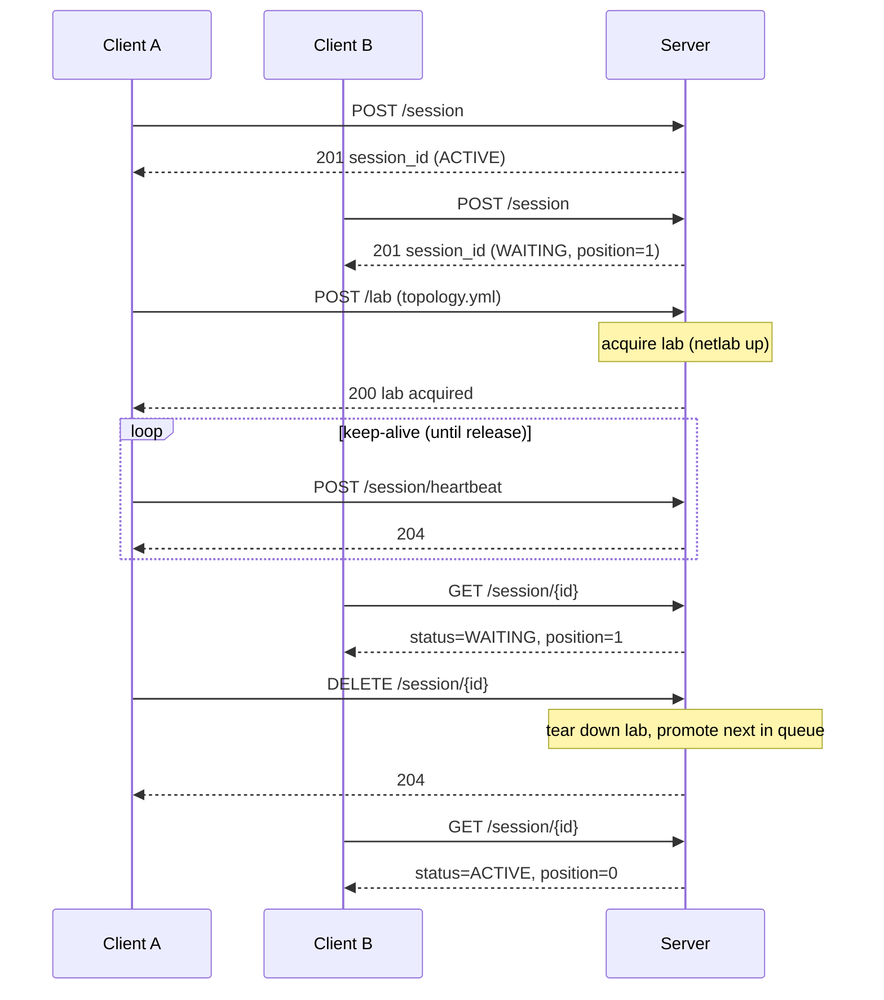

# Neops Remote Lab

Run network labs on a shared server, test from anywhere. Neops Remote Lab manages [Netlab](99-appendix/glossary.md#netlab) [topologies](99-appendix/glossary.md#topology) on a remote host while your pytest suite stays local -- a lightweight [Remote Lab server](10-concepts/10-architecture.md#components) schedules exclusive [sessions](99-appendix/glossary.md#session) through a queue, letting CI jobs and developers safely share the same lab infrastructure.

!!! tip "New to Remote Lab?"
    Start with [Getting Started](getting-started/index.md) -- the three-step path (setup, cURL walkthrough, pytest fixture) takes about 30 minutes end-to-end.

## How It Works

A session queue serializes access. The first client gets an `ACTIVE` session immediately; subsequent clients wait in line. Once active, a client uploads a topology file and the server orchestrates Netlab to bring the lab up. Heartbeats keep the session alive; when the client finishes, the lab tears down and the next session promotes.

## Key Features

- **One-lab-per-host exclusivity** -- only one Netlab topology runs at a time, enforced by a FIFO session queue and automatic reference counting.
<!-- trace: neops_remote_lab/testing/fixture.py:34 -->
- **Single-mode client** -- `remote_lab_fixture` runs against a Remote Lab server exclusively; set `REMOTE_LAB_URL` and the session-scoped `remote_lab_client` fixture connects on first use (raises `RuntimeError` if the variable is unset).
- **Lab reuse** -- tests sharing the same topology can reuse a running lab instead of tearing down and rebuilding, identified by SHA-256 content hash.
- **Automatic cleanup** -- stale sessions are detected via heartbeat timeouts and cleaned up by an adaptive background task.
- **Python client and pytest plugin** -- `RemoteLabClient` for programmatic access; `remote_lab_fixture` for declarative test fixtures.

## Why this tool vs alternatives

Remote Lab is not the only way to run network labs for integration tests. It earns its place when several developers or CI jobs need to share one lab host without stepping on each other. Here is how it compares to the adjacent options:

- **Netlab running on the developer's own machine.** If one person runs the lab on their own laptop or server and never shares it, plain Netlab is simpler -- no HTTP surface, no queue, no FIFO serialization. Remote Lab adds value only once two or more clients (CI jobs, teammates, scheduled suites) start contending for a single lab host.
- **Containerlab directly, without Netlab.** Containerlab is the lower layer Netlab generates for (`provider: clab`). Going directly to Containerlab means hand-writing `clab.yml` per topology, managing the container lifecycle yourself, and losing Netlab's declarative modules (OSPF, BGP, VRFs). Remote Lab keeps Netlab's abstraction and adds serialized multi-client access; it does not replace either.
- **GNS3, EVE-NG, or Cisco CML.** These are GUI-driven, full-featured network simulators aimed at interactive use, certification labs, and long-lived topology design. Remote Lab is headless and pytest-first: topologies are YAML files, the unit of access is an API session, and the intended consumer is a test runner, not a human clicking through a web UI. If your workflow is manual exploration, a GUI simulator is a better fit; if it is automated testing of function blocks against live devices, Remote Lab is.

In short: one developer, one host -- use plain Netlab. Several testers or CI jobs sharing one host -- Remote Lab's queue is what you want. Manual lab design or training scenarios -- pick a GUI simulator instead.

## Where This Fits

Remote Lab is consumed primarily by **[neops-worker-sdk-py](https://github.com/zebbra/neops-worker-sdk-py)** (the Python SDK for writing neops workers), which imports the public `remote_lab_fixture` factory to run integration tests against real Netlab topologies. Within the broader [neops platform](https://github.com/zebbra), workers built with the SDK execute [**function blocks**](99-appendix/glossary.md#function-block) -- typed Python classes that operate on device inventory entities. The [**workflow engine**](https://github.com/zebbra/neops-workflow-engine) dispatches jobs to those workers through a [**blackboard**](99-appendix/glossary.md#blackboard) (the engine's job queue); Remote Lab sits underneath that stack, providing the virtual devices a function block test can exercise before real hardware is touched.

The fixture's call signature is a stable API contract -- changes go through deprecation cycles. The server runs on a VM with Netlab and [Containerlab](99-appendix/glossary.md#containerlab) installed; the client runs wherever your tests run -- a developer laptop, CI runner, or any machine with network access to the server. A [Headscale/Tailscale VPN](99-appendix/glossary.md#headscale) typically routes traffic between the test runner and lab subnets.

## Explore the Docs

| Section | What you'll find | Time |
|---------|-----------------|------|
| [Getting Started](getting-started/index.md) | Install, configure, run your first remote lab session | ~30 min |
| [Concepts](10-concepts/index.md) | Architecture, session queue mechanics, lab lifecycle | ~20 min |
| [Server](20-server/index.md) | REST API reference, configuration, administration | ~15 min |
| [Client](30-client/index.md) | `RemoteLabClient` API, pytest fixture factory | ~10 min |
| [Testing](40-testing/index.md) | Local vs. remote testing patterns, debugging | ~15 min |
| [Deployment](50-deployment/index.md) | Netlab setup, Headscale VPN, production deployment | ~20 min |
| [Development](60-development/index.md) | Internal architecture, data models, contributing | ~15 min |
| [Appendix](99-appendix/index.md) | Glossary (jargon-busters for Netlab, pytest, and VPN terms), examples index, external resources | ~5 min |
