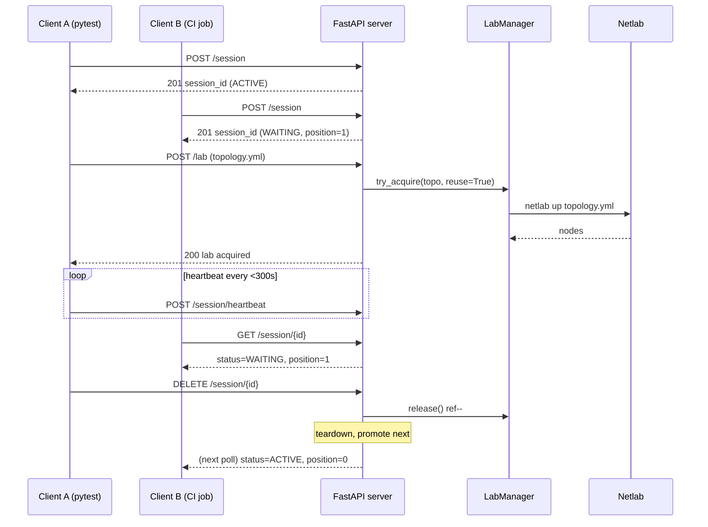

# Neops Remote Lab

*A FastAPI service exposing exclusive, queue-brokered access to a real [Netlab](https://netlab.tools/) topology — drive it from a pytest11 plugin (Python), the bundled REST API (any stack), or both.*

Network-automation tests want real devices, not mocks. But [Netlab](https://netlab.tools/) only lets
one topology run per host, so a shared lab host turns into a collision
playground the moment more than one engineer — or more than one CI job —
presses *run*. `neops-remote-lab` fronts that host with a small HTTP service
and a pytest fixture: every test asks for a session, waits its turn in a FIFO
queue, gets the lab, then tears it down when the last consumer walks away.

<!-- trace: neops_remote_lab/server.py:390 -->
<!-- trace: neops_remote_lab/netlab/lab_manager.py:43 -->

## Where it sits in the neops ecosystem

This repository ships two cooperating surfaces: a **FastAPI server**
(`neops_remote_lab.server`) that runs on the lab host, and a **pytest11
plugin** (`neops_remote_lab.testing.fixture`) that runs inside your test
suite. The plugin's `remote_lab_fixture` factory is the **stable public API** —
the [**Worker SDK**](https://docs.neops.io/neops-worker-sdk-py/docs/) imports it
directly to give [function-block](https://docs.neops.io/neops-worker-sdk-py/docs/function-blocks/)
tests a real topology to run against ([Worker SDK → Remote lab testing](https://docs.neops.io/neops-worker-sdk-py/docs/testing/30-remote-lab/)),
so its call signature is a contract you can rely on across releases:
you can focus on your test code without worrying that an upstream change will
quietly rearrange the fixture under you.

<!-- trace: AGENTS.md:3 -->

!!! note "Two audiences, one project"
    If you are writing tests, you will only touch the pytest side
    (`remote_lab_fixture`, `RemoteLabClient`). If you are running the
    service on a shared host, you will mostly live in the FastAPI side and
    the Netlab + VPN deployment pages. Both sides share the same vocabulary
    ("session", "lab", "reuse") and the same FIFO contract.

!!! danger "Internal-trust service — no HTTP authentication"
    `neops-remote-lab` ships **without** HTTP authentication. The only
    access boundary on `/lab/*` endpoints is the `X-Session-ID` header of an
    ACTIVE session; non-active sessions receive `423 Locked`. The
    `/session/heartbeat` endpoint is gated less tightly — it only requires
    the session to exist (404 if unknown) and accepts heartbeats from
    WAITING sessions too, which is how a client keeps its queue slot alive
    before promotion. **Deploy only on a Headscale tailnet or another
    private network.** See
    [Administration → Security posture](30-server/30-administration.md#security-posture)
    for the full threat model and
    [Headscale VPN](40-deployment/20-headscale-vpn.md) for the recommended enclosure.
    <!-- trace: neops_remote_lab/server.py:488 -->

## Session-and-lab lifecycle

Every test follows the same four-step lifecycle: **create a session** (which
joins the queue), **wait to become active**, **upload a topology and
acquire the lab**, then **release** on teardown. Client B waits behind
Client A without ever touching a lock.

<!-- trace: neops_remote_lab/server.py:390 -->

*Session-and-lab lifecycle: FIFO queue → exclusive access → shared teardown
when the last user leaves.* The promotion rules, stale-session timeouts, and
heartbeat cadence are detailed in
[Session queue](10-concepts/20-session-queue.md); the
SHA-256-keyed reuse counting is covered in
[Lab lifecycle](10-concepts/30-lab-lifecycle.md).

## Who uses this?

-   **Neops SDK consumers** — you want a fixture that gives you a real device

    ---

    Declare `remote_lab_fixture("path/to/topology.yml")` in `conftest.py`,
    write your test, run `pytest`. Session, queue, and lifecycle disappear
    into the fixture. When you want to drive the service from a script
    instead, the same package ships a `RemoteLabClient` you can call directly.

    [Open Getting Started →](getting-started/index.md)

-   **Operators** — you want to run this on a shared host

    ---

    Startup sequence, single-instance filelock recovery, stale-lab
    cleanup, the [Headscale enclosure](40-deployment/20-headscale-vpn.md),
    and the security posture you sign up for.

    [Open the Server reference →](30-server/index.md)

-   **Contributors** — you want to change the codebase

    ---

    Invariants you must preserve, the conventions code review enforces
    (`*Dto` suffix, `_run_blocking()` discipline, `connector.run_netlab()`
    as the only Netlab path), the CVE-pinned dependencies, and the
    branch-to-PR flow.

    [Open AGENTS.md on GitHub →](https://github.com/zebbra/neops-remote-lab/blob/develop/AGENTS.md)

-   **External API users** — you want exclusive lab access from any HTTP-capable stack

    ---

    Drive the lab from cURL, Go, Robot Framework, your CI shell pipeline,
    or any other tool that speaks HTTP. The Python client and pytest fixture
    are convenience layers; the REST API is the universal surface and is
    fully documented.

    [Open the REST quickstart →](getting-started/30-rest-quickstart.md)

## Reading paths

Pick the route that matches your current question.

!!! tip "New to the project — you want your first passing test"
    [Quickstart](getting-started/10-quickstart.md) → [Pytest fixtures](20-client/10-pytest-fixtures.md) →
    [Topology format](10-concepts/40-topology-format.md).
    You will install the client, write a three-line test, and see it pass.

!!! info "Concepts first — you want to understand before you build"
    [Architecture](10-concepts/10-architecture.md) → [Session queue](10-concepts/20-session-queue.md) →
    [Lab lifecycle](10-concepts/30-lab-lifecycle.md) → [Topology format](10-concepts/40-topology-format.md).
    These four pages cover every invariant the system enforces and why.

!!! info "Standing up the host — you are deploying the service"
    [Netlab host setup](40-deployment/10-netlab-host-setup.md) →
    [Headscale VPN](40-deployment/20-headscale-vpn.md) →
    [Administration](30-server/30-administration.md) → [Configuration](30-server/20-configuration.md).
    Install Netlab, enclose the host in a private tailnet, then configure
    and operate the server.

!!! info "Wiring in a new client — you are integrating a consumer"
    [REST API](30-server/10-rest-api.md) → [Python client](20-client/20-python-client.md) →
    [Pytest fixtures](20-client/10-pytest-fixtures.md).
    The API reference is authoritative; the Python client is a thin
    wrapper over it; the fixture is the stable consumer surface.

!!! info "Driving from a non-Python stack — you are integrating into an existing harness"
    [REST quickstart](getting-started/30-rest-quickstart.md) →
    [CI integration](30-server/40-ci-integration.md) →
    [Debugging](30-server/50-debugging.md).
    Stand up a session and a lab end-to-end with cURL, then wire it into
    your CI runner of choice.

## External references

- [neops platform docs](https://docs.neops.io/) — the umbrella site
  hosting all neops project docs (Workflow Engine, Worker SDK, Remote
  Lab, Web Client, Secure Gateway). Start here if you arrived from a
  peer project and want to see how Remote Lab sits in the platform.
- [Netlab](https://netlab.tools/) — the upstream lab orchestrator this
  service wraps. Authoritative reference for topology YAML, providers, and
  vendor kinds.
- [Worker SDK](https://docs.neops.io/neops-worker-sdk-py/docs/) — the primary
  consumer of this package; imports `remote_lab_fixture` as a stable API
  ([integration guide](https://docs.neops.io/neops-worker-sdk-py/docs/testing/30-remote-lab/)).
- [Containerlab](https://containerlab.dev/) — the container runtime Netlab
  drives by default in this project (`provider: clab`).
- [Headscale](https://headscale.net/) — the open-source Tailscale control
  plane used for the recommended VPN enclosure
  ([deployment guide](40-deployment/20-headscale-vpn.md)).
- [Material for MkDocs reference](https://squidfunk.github.io/mkdocs-material/reference/)
  and [pymdown-extensions Snippets](https://facelessuser.github.io/pymdown-extensions/extensions/snippets/)
  — theme and extension docs backing this site.
- Project [`README.md`](https://github.com/zebbra/neops-remote-lab/blob/develop/README.md) and
  [`AGENTS.md`](https://github.com/zebbra/neops-remote-lab/blob/develop/AGENTS.md) — repository-level
  conventions, invariants, and agent context.
