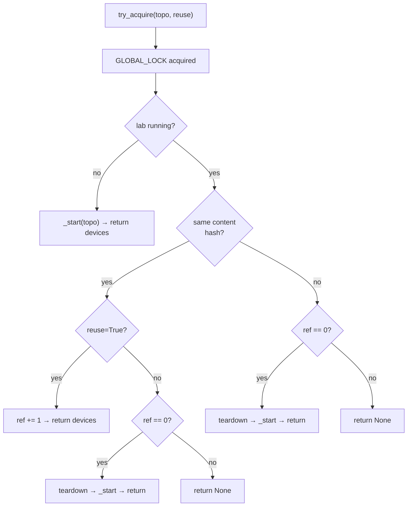

# Lab Lifecycle

When a test asks for a lab, four things have to happen in the right order:
identify the topology, decide whether an existing lab can be reused, either
reuse it or start a fresh one, and count the acquisition so nothing tears the
lab down while it's still in use. `LabManager` encapsulates that bookkeeping.

> **Why reference counting?** Many tests need the *same* topology. Spinning
> it up once and letting several clients share it turns a 5-minute Netlab
> boot into a one-time cost per test session. But sharing has to be opt-in
> (a test that mutates device configs shouldn't silently collide with a
> reader), and the last user has to know it's the last user. That's what the
> ref counter tracks.

## Topology identity is content, not filename

<!-- trace: neops_remote_lab/netlab/lab_manager.py:129 -->
When `LabManager._start` receives a topology it hashes the file content with
SHA-256 and stores the digest in `_current_topo_hash`. Every subsequent
acquire request hashes its own candidate topology and compares digests.

Two files called `simple_frr.yml` and `frr_reused.yml` with byte-identical
contents are therefore the same topology: a reuse request from one succeeds
against a lab started by the other.

!!! tip "This lets you copy topologies without fragmenting reuse"
    A test helper that copies a vendored topology into each test's workdir
    still gets reuse for free, as long as the content is unchanged. The
    filename is purely cosmetic.

## try_acquire vs acquire

These two methods look almost identical in their signatures, and they call
the same internal helpers. The difference is what they do when the lab is
busy.

<!-- trace: neops_remote_lab/netlab/lab_manager.py:172 -->
`try_acquire(topo, reuse=True)` is non-blocking. It returns a device list
when the lab is free, the same-content reuse path succeeds, or a
same-content exclusive restart succeeds; it returns `None` when the lab is
busy with an incompatible request.

<!-- trace: neops_remote_lab/netlab/lab_manager.py:163 -->
`acquire` is a polling wrapper: it calls `try_acquire`, sleeps 2 seconds if
the return is `None`, and retries forever until it succeeds.

!!! danger "Use the right one for your context"
    The server MUST use `try_acquire`. Blocking the event loop for minutes
    on a busy lab would stall every other session's poll. `POST /lab` on a
    busy lab returns `423 Locked` and expects the client to retry.

    Local tests (running against a `LabManager` in the same process, not
    over HTTP) typically use `acquire` because they are the only caller and
    blocking is the point — they want the lab when it's free.

    Mixing them is how you hang a test suite: call `acquire` from inside
    the server's event loop and the loop never wakes up to process the
    release that would let you in.

## The decision tree



## Reuse: the refcount increments

<!-- trace: neops_remote_lab/netlab/lab_manager.py:190 -->
When the topology content hashes match and the caller sets `reuse=True`,
`LabManager` increments the handle's `ref` counter and hands back the
existing device list. Netlab is not invoked — the running containers are
already up, so the call returns in milliseconds.

Expected log line on a reuse:

```
Re-using lab simple_frr.yml (ref=2)
```

The same lab can fan out to as many concurrent sessions as the queue allows.
In the REST surface this is driven by `reuse=true` on the multipart upload;
on the fixture side it's the `reuse_lab=True` keyword.

## Release: the refcount decrements

<!-- trace: neops_remote_lab/netlab/lab_manager.py:251 -->
`release` (or the server's `release_current` wrapper) decrements the
counter. Crucially, **hitting zero does not tear the lab down**. The lab
becomes "idle": still running, still responsive on its management
interfaces, but unowned. The next acquire decides its fate.

| Next event | Outcome |
|---|---|
| Same-content acquire with `reuse=True` | Lab is reused; refcount goes from 0 to 1. |
| Same-content acquire with `reuse=False` | Current lab is torn down, fresh lab started with the same content. |
| Different-content acquire | Current lab is torn down (topology switch), new lab started. |
| Interpreter exits | `atexit` handler tears the lab down. |
| Session stale timeout | Server runs `LabManager.cleanup`, lab is torn down. |

??? info "Why idle and not teardown?"
    Keeping an idle lab running is cheap (the containers are already
    booted). Tearing it down and restarting it on the very next test is
    expensive. The policy trades a few seconds of idle CPU for not paying
    Netlab boot cost repeatedly in a tight run.

## Topology switch: tear down, spin up

<!-- trace: neops_remote_lab/netlab/lab_manager.py:202 -->
When a caller requests a topology whose content differs from the current
one, the switch is only allowed if the current refcount is zero. If the
current lab is in use, the caller gets `None` back and has to wait. When
the current lab is idle, `_terminate_current` runs `netlab down --cleanup`
and `_start` brings up the new topology.

```
Switching topology from simple_frr.yml to spine_leaf.yml
Starting lab spine_leaf.yml - this may take several minutes...
```

## atexit is the last safety net

<!-- trace: neops_remote_lab/netlab/lab_manager.py:327 -->
At module import time `LabManager` registers a `_atexit_cleanup` function
with `atexit.register`. When the interpreter exits, this runs
`LabManager.cleanup(silent=True)` synchronously, which acquires the global
file lock and tears down any running lab.

The `silent=True` flag disables logging for the duration of the call — by
the time `atexit` runs, the logging handlers have already had their streams
closed, and logging through them raises `ValueError: I/O operation on
closed file`.

!!! danger "Never add async code to this path"
    Once the interpreter reaches `atexit`, there is no running event loop.
    If any `LabManager` teardown code awaits a coroutine, or blocks on an
    asyncio primitive, it deadlocks and the process has to be killed. The
    current teardown is synchronous subprocess calls to `netlab down
    --cleanup`; keep it that way.

!!! info "It also runs if someone forgot to release"
    A test that raises before reaching its `finally` block may never call
    release. The `atexit` hook still fires when the pytest process exits,
    so a lab that would otherwise be orphaned gets cleaned up. The queue
    head advances on the next server tick when the session times out.

## Long-running CI host sanity check

<!-- trace: neops_remote_lab/netlab/lab_manager.py:125 -->
Before starting any new lab, `_start` calls
`_terminate_default_netlab_instance` to forcibly run
`netlab down --instance default --cleanup`. This is an unconditional,
best-effort cleanup designed for long-lived CI hosts: if a previous job
crashed before its own teardown, the `default` netlab instance may still
be live on the host, and `netlab up` would fail with *"It looks like the
lab instance 'default' is already running"*.

The call is made with `expected_failure=True`, so when no default instance
exists it's a silent no-op.

## The `.yml` extension trap

<!-- trace: neops_remote_lab/netlab/lab_manager.py:68 -->
`prepare_workdir` copies the topology into a fresh temp directory, but
only if the source has a `.yml` extension (lowercase). Anything else —
including `.yaml` — raises `ValueError("Topology must be a .yml file")`.

The HTTP layer in `server.py` is more permissive and accepts either
`.yml` or `.yaml` at upload time. A `.yaml` upload therefore fails **after**
the session has already been promoted to ACTIVE, wasting a queue slot.

!!! warning "Canonicalise your topology filenames to .yml"
    Anywhere you reference a topology — fixture arguments, CI artifact
    names, Docker volume mounts — use `.yml`. See
    [topology-format.md](topology-format.md) for the broader contract.

## Where to go next

- [topology-format.md](topology-format.md) — what goes inside the YAML
  file, and what `extra_files` can deliver alongside it.
- [session-queue.md](session-queue.md) — how session promotion and
  eviction drive the lifecycle transitions above.
- [architecture.md](architecture.md) — where `LabManager` fits in the
  overall request flow.
